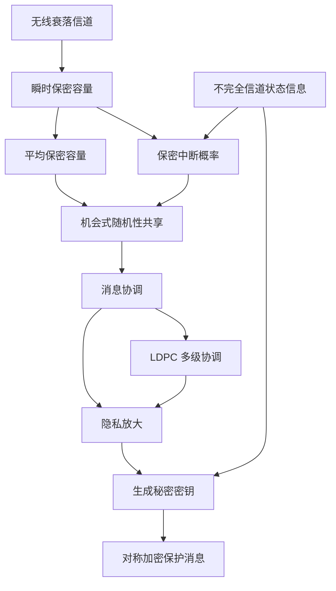

# Advanced - 无线信息论安全

> 本讲义聚焦于：如何利用无线衰落信道的随机性，在不依赖无差错公开信道的前提下，机会式生成信息论安全密钥，并评估其安全吞吐量与工程边界。

## 示例导入

假设 Alice 想通过无线信道向 Bob 发送一段机密消息，但她担心 Eve 在旁边窃听。  
如果 Alice 直接发消息，Eve 可能把它听得一清二楚；但如果 Alice 先利用“这次信道刚好对 Bob 更有利”的时刻，与 Bob 共享一段随机比特，再通过协调、隐私放大生成密钥，最后用这个密钥加密消息，那么即使 Eve 也在监听，她得到的信息仍可被压到极低。

这个过程的关键不是“信道绝对安全”，而是：

1. **衰落会制造有利时刻**：有些时刻主信道比窃听信道更好；
2. **只在有利时刻发送随机性**：把信道波动转化为安全资源；
3. **先生成密钥，再保护消息**：把“安全通信”拆成“安全密钥协商 + 对称加密”；
4. **即使 CSI 不完全，也能做保守设计**：通过中断概率和安全裕度控制泄露风险。

换句话说，本周资料回答的是：**如何从“无线信道有噪声、有衰落”这件事中，反过来提取安全性。**

---

## 核心知识

### 1. 研究对象：准静态瑞利衰落窃听信道

资料研究的是一个经典的无线窃听模型：

- Alice 发送码字 \(X^n\)；
- Bob 经由主信道接收 \(Y_m(i)=H_m(i)X(i)+Z_m(i)\)；
- Eve 经由独立的窃听信道接收 \(Y_w(i)=H_w(i)X(i)+Z_w(i)\)。

其中：

- \(H_m, H_w\) 是复高斯衰落系数；
- \(Z_m, Z_w\) 是复高斯噪声；
- **准静态衰落**表示：一个码字传输期间信道不变，不同码字之间独立。

这类模型的重要性在于：  
衰落不是纯粹的坏事，它会让某些时刻 Bob 的信道显著优于 Eve，从而出现**瞬时保密容量大于 0** 的机会。

---

### 2. 瞬时保密容量：本质是“主信道优于窃听信道”的差值

对于一次衰落实现 \((\gamma_m,\gamma_w)\)，资料给出瞬时保密容量：

\[
C_s(\gamma_m,\gamma_w)=
\begin{cases}
\log(1+\gamma_m)-\log(1+\gamma_w), & \gamma_m>\gamma_w\\
0, & \gamma_m\le \gamma_w
\end{cases}
\]

这说明：

- 如果 Bob 端瞬时信噪比高于 Eve，则可获得正保密速率；
- 否则保密容量为 0。

这里的关键不是平均值，而是**每次衰落实现的相对强弱**。

---

### 3. 平均保密容量：衰落为什么可能“帮忙”

资料强调了一个非常重要的结论：

> 即使 Eve 的平均 SNR 比 Bob 高，衰落仍可能使平均保密速率非零。

平均保密容量定义为对所有衰落实现取期望：

\[
C_s=\int_0^\infty\int_0^\infty C_s(\gamma_m,\gamma_w)p(\gamma_m)p(\gamma_w)\,d\gamma_m d\gamma_w
\]

资料还给出两个非常有启发性的结论：

- 当 \(\gamma_m \gg \gamma_w\) 时，严格正保密容量概率接近 1；
- 当 \(\gamma_w \gg \gamma_m\) 时，这个概率接近 0。

如果将平均 SNR 与距离联系起来：

\[
\gamma_m \propto \frac{1}{d_m^\alpha},\qquad \gamma_w \propto \frac{1}{d_w^\alpha}
\]

则严格正保密容量的概率可写成：

\[
P[C_s>0]=\frac{1}{1+(d_m/d_w)^\alpha}
\]

这揭示了无线物理层安全的一个直观事实：  
**Eve 离 Alice 越远，Alice 与 Bob 越容易获得保密机会。**

---

### 4. 中断概率：比平均容量更适合工程分析

资料进一步引入**保密中断概率**：

\[
P_{\text{out}}(R_s)=P[C_s<R_s]
\]

它的意义有两层：

1. 给出“达到目标安全速率 \(R_s\)”的概率；
2. 在 Eve 的 CSI 不可得时，提供一种保守的安全评估方法。

资料给出中断概率形式，并分析了极端情况：

- \(R_s\to 0\) 时，中断概率趋近于窃听信道相对强势的概率；
- \(R_s\to \infty\) 时，中断概率趋近 1，说明过高的安全速率不可行；
- 当 \(\gamma_m\gg\gamma_w\) 时，中断概率大致按 \(1/\gamma_m\) 衰减；
- 当 \(\gamma_w\gg\gamma_m\) 时，中断概率接近 1。

#### 工程含义
中断概率告诉我们：  
**不是所有时刻都适合发送安全信息，机会式策略应只在“足够安全”的衰落状态下工作。**

---

### 5. 不完全 CSI：现实场景下的保守安全设计

资料考虑了更现实的情况：Alice 对 Eve 信道只有不完全估计：

\[
\hat H_w = H_w + Z'_w
\]

其中 \(Z'_w\) 是估计误差。  
这时如果 Alice 过于乐观，就可能低估 Eve 的能力，导致“以为安全，实际上泄露”。

资料给出了一个中断概率上界，指出它与估计误差方差 \(\sigma_e^2\) 有关。  
这里一个看似反直觉的现象是：

- **误差越大，中断上界反而可能越低**。

原因在于：  
当估计较差时，Alice 往往会更保守，倾向于低估 Eve 信道，从而反而更可能把速率设得偏低，减少中断风险。  
但这并不意味着“估计越差越好”，只是说明中断上界的行为并不单调等同于直觉中的“性能越差越危险”。

---

### 6. 机会式秘密密钥协商：本文的核心协议框架

资料提出一个四步协议，把无线衰落转化为安全密钥：

1. **机会式随机性共享**  
   仅在瞬时保密容量足够大时，通过无线信道发送随机符号，让 Bob 和 Eve 获得相关观测。

2. **消息协调**  
   Alice 和 Bob 用额外纠错信息修正随机性差异，使双方共享同一随机序列。

3. **隐私放大**  
   从共享随机性中压缩提取秘密比特，抵消 Eve 已知的信息。

4. **秘密密钥保护消息**  
   用生成的密钥加密后续消息，可用一次一密或标准对称密码。

#### 关键约束
协议只要求 **Alice 到 Bob 的单向前馈通信**，不依赖无噪、认证公开信道。  
这是资料中非常重要的设计选择，因为它减少了系统依赖。

---

### 7. 协调：从源编码角度理解 Slepian-Wolf 过程

协调阶段本质上是一个**带边信息的源编码问题**。

Alice 有序列 \(X^n\)，Bob 观测到相关序列 \(Y_m^n\)。  
Alice 需要发送纠错信息，让 Bob 恢复 Alice 的随机序列。

资料指出所需附加比特数下界由 Slepian-Wolf 定理给出：

\[
M_{\text{rec}} \ge H(X^n|Y_m^n)=nH(X|Y_m)
\]

实际系统中会有协调效率 \(\beta\le 1\)，于是协调所需比特数可写为：

\[
M_{\text{rec}}=n\left(H(X)-\beta I(X;Y_m)\right)
\]

这说明：

- Bob 观测越可靠，所需协调信息越少；
- 但如果协调效率太差，密钥生成收益会被大量开销吞掉。

---

### 8. 隐私放大：把“部分随机”压缩成“几乎完全安全”

协调后，Alice 和 Bob 得到一个共享比特序列 \(S\)。  
但 Eve 也知道一部分相关信息，因此不能直接把 \(S\) 当密钥。

资料采用通用哈希函数族做隐私放大：

\[
K=G(S)
\]

其中 \(G\) 从通用哈希函数族中随机选取。  
核心思想是：**把 Eve 已知的信息“挤掉”**，只保留剩余的不可预测性。

从结果上看，密钥长度 \(k\) 需要满足大致关系：

\[
k \approx n\big(\beta I(X;Y_m)-I(X;Y_w)\big)
\]

也就是说：

- Bob 获得的信息越多，越适合生成密钥；
- Eve 获得的信息越多，最终可提取密钥越短；
- 协调效率 \(\beta\) 是关键折损项。

---

### 9. 为什么使用 LDPC 码：从“理论可行”走向“工程可实现”

资料的一个核心贡献是：  
提出了基于 **多级编码（MLC）+ 多阶段译码（MSD）+ LDPC 码** 的协调算法。

#### 设计动机
- 二进制协调已有较多成果；
- 非二进制随机变量的实用协调较少；
- 直接用普通 BICM 风格方法往往次优；
- 多级编码更接近 Shannon 意义下的最优协调率。

#### 关键思想
对星座点的二进制标签逐层编码，每层都设计一个分量码。  
这与调制/解调中的多级结构类似。

#### 为什么不是 BICM？
资料明确指出：

- 类 BICM 的协调通常需要严格多于 \(H(X|Y_m)\) 的附加比特；
- MLC/MSD 由于分层处理更灵活，整体更接近最优。

#### 码率分配
通过熵链式法则：

\[
H(X|Y_m)=\sum_k H(\ell_k(X)\mid \ell_0(X),\ldots,\ell_{k-1}(X),Y_m)
\]

每层最优码率为：

\[
R_k^{\text{opt}}=1-H(\ell_k(X)\mid \ell_0(X),\ldots,\ell_{k-1}(X),Y_m)
\]

这意味着：
- 每一层的信息量不同；
- 码率必须逐层匹配；
- 实际设计中要兼顾可构造性和有限长度性能。

---

### 10. 自然二进制映射与 EXIT 分析：工程上为何重要

资料指出，自然二进制映射有一个有用性质：  
它能保持随机变量分布的对称结构，使得最低层比特面对的等效信道具有输出对称性，从而可用标准 LDPC 设计方法。

同时，码率分配通过 **EXIT 图** 进行分析：

- 解映射器从先验信息中产生外信息；
- 译码器再将外信息反馈给下一层；
- 通过匹配两者传递曲线，选择合适码率。

资料中给出的经验结论是：

- SNR 较高时，只需要较少层数的码；
- 当星座足够大且码率合适时，协调效率可以很高；
- 在本文设定下，SNR 高于约 2 dB 时算法表现较好。

---

### 11. 性能指标：安全吞吐量与通信吞吐量

资料没有只看“能不能生成密钥”，而是进一步定义了系统级指标。

#### 平均 η-安全吞吐量 \(T_s(\eta)\)
表示每个信道使用中，能支持的平均密文比特数，其中密钥和密文长度之比为 \(\eta\)。

- \(\eta=1\)：一次一密，对应完美保密；
- \(\eta<1\)：一个密钥比特可以保护多个消息比特，但信息论完美性不再成立。

#### 平均 η-通信吞吐量 \(T_c(\eta)\)
表示除协调、隐私放大和加密开销之后，真正能额外传输的消息比特数。

#### 重要结论
机会式协议的最大安全吞吐量需要同时满足：

- 生成密钥的收益足够大；
- 协调和隐私放大的通信开销不能过高；
- 在机会式发送之外，还要预留主信道容量的一部分用于信息传输。

---

### 12. 渐近分析：保密受限区域与通信受限区域

资料把系统性能分成两个极端区域。

#### 12.1 保密受限区域
当主信道很弱时，系统主要受 Eve 的限制。  
此时协议的吞吐量接近平均保密容量，但可能因为近似和协调损耗而出现保守界。

#### 12.2 通信受限区域
当主信道很强时，协议的瓶颈变成了“能否把协议信息传完”。  
结果表明：

\[
T_s(\eta)=O(\eta^{-1}\log \gamma_m)
\]

即吞吐量随主信道 SNR 对数增长。

#### 工程解读
这说明：

- 主信道越好，并不意味着安全吞吐量线性增长；
- 机会式协议的增长受制于协调、隐私放大以及保密裕量；
- 其增长规律更接近“对数级提升”。

---

### 13. 不完全 CSI 下的真实安全吞吐量与泄露吞吐量

资料最后讨论了现实中更常见的问题：  
Alice 只能估计 Eve 信道，而非准确知道它。

为此定义了：

- **真实平均安全吞吐量** \(R_s\)
- **平均泄露吞吐量** \(R_l\)

二者分别对应“实际上安全的部分”和“实际上泄露的部分”。

一个重要结论是：  
当 Alice 对 Eve 的信道估计偏保守时，安全吞吐量会下降，但泄露也会降低。  
于是可以通过引入安全裕度参数 \(\alpha\) 来控制风险：

- \(\alpha\) 越大，越保守；
- 泄露越小；
- 但能生成的密钥越短。

这体现了无线物理层安全里最典型的工程权衡：  
**安全性、吞吐量、信道认知程度三者不能同时最优。**

---

### 14. 资料给出的总体结论

资料的结论可以概括为：

1. **衰落不是障碍，而是资源**；
2. **安全密钥协商比直接设计窃听码更容易工程化**；
3. **单向前馈、协调、隐私放大、加密构成完整方案**；
4. **LDPC 多级协调是可实现且接近最优的方案之一**；
5. **不完全 CSI 下仍可通过保守设计维持安全性**；
6. **物理层安全更适合作为分层安全体系的一部分，而不是替代经典密码。**

---

---

## 关键术语

- **保密容量（Secrecy Capacity）**：在保证 Eve 获得信息可忽略的前提下，Alice 到 Bob 可实现的最大传输速率。
- **平均保密容量**：对所有衰落实现求期望后的保密容量，反映长期平均可达安全速率。
- **保密中断概率**：瞬时保密容量低于目标安全速率的概率，衡量安全服务可用性。
- **准静态衰落**：一个码字传输期间信道增益不变，不同码字之间独立变化。
- **Slepian-Wolf 定理**：带边信息的源编码定理，给出分布相关源协调所需的最低通信量。
- **隐私放大（Privacy Amplification）**：通过压缩把共享但部分泄露的随机性转换为高保密密钥的技术。
- **通用哈希函数族**：满足良好碰撞性质的一类哈希函数，常用于隐私放大。
- **LDPC 码**：低密度奇偶校验码，适合高效纠错和边信息协调。
- **多级编码/多阶段译码（MLC/MSD）**：按比特层级逐层编码和译码的结构，适合非二进制协调。
- **CSI（信道状态信息）**：对信道衰落或增益的知识；可分为完美 CSI 和不完全 CSI。
- **机会式传输**：只在信道条件满足某个阈值时才发送，从而提高安全或可靠性。

---

## 常见误区

- **误区 1：平均 SNR 高就一定更安全。**  
  资料表明不一定，衰落下的瞬时优势更关键。

- **误区 2：只要有窃听者，就一定没有信息论安全。**  
  不一定。若主信道某些时刻优于窃听信道，仍可生成密钥。

- **误区 3：协调只是普通纠错。**  
  不完全是。它本质上是带边信息的源编码，目标是让双方共享同一随机性。

- **误区 4：隐私放大只是“再压缩一下”而已。**  
  不对。它是利用通用哈希把 Eve 已知的信息系统性“抹掉”。

- **误区 5：CSI 越差，安全性一定越差。**  
  资料给出的中断分析显示，结果并不总是直观单调的；但这不等于“估计差更好”，而是说保守偏差会改变系统行为。

- **误区 6：物理层安全可以完全替代经典密码。**  
  资料明确强调，实际系统更适合做成分层安全，物理层安全只是额外一层防护。

---

## 自测问题

- 为什么准静态衰落信道中可能出现严格正的保密容量？
- 瞬时保密容量为什么写成主信道容量与窃听信道容量之差？
- 平均保密容量和保密中断概率分别适合回答什么问题？
- 为什么机会式秘密密钥协商只在某些衰落实现下发送随机性？
- Slepian-Wolf 协调在这里扮演什么角色？
- 隐私放大为什么必须和通用哈希函数族结合使用？
- 为什么资料更偏向使用 LDPC 多级编码而不是普通 BICM？
- 协调效率 \(\beta\) 会如何影响最终可提取的密钥长度？
- 在不完全 CSI 情况下，为什么要引入安全裕度参数 \(\alpha\)？
- 物理层安全与传统计算安全各自的优势和局限是什么？

如果你愿意，我还可以把这份讲义进一步整理成：
1. **课堂版精简提纲**，或  
2. **考试复习版重点总结**。
