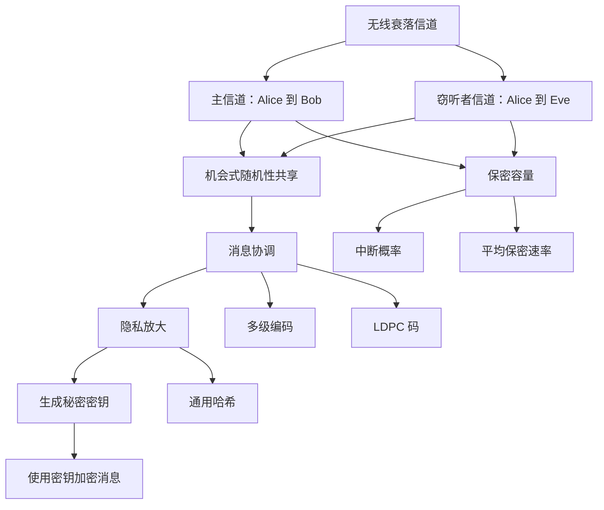

# Beginner - 无线信息论安全入门

> 本讲义帮助你理解：在无线信道会随机波动的条件下，怎样利用“衰落”来生成秘密密钥，并用这些密钥实现安全通信。

## 示例导入

假设 Alice 想通过无线网络把一条消息发给 Bob，同时担心 Eve 在旁边偷听。

如果无线信道一直很稳定，Eve 可能只要监听到同样的信号，就能获得很多信息。  
但如果信道会“忽好忽坏”，情况就变了：

1. 某些时刻，Alice 到 Bob 的信道很强；
2. 某些时刻，Alice 到 Eve 的信道很弱；
3. Alice 和 Bob 只在“对自己更有利”的时刻传输随机符号；
4. 他们先共享一段随机性，再把这段随机性整理成秘密密钥；
5. 最后，拿这个密钥去加密真正的消息。

这样，哪怕 Eve 能听到无线电波，也不一定能恢复出密钥或消息。

这篇资料讨论的就是这个思想：  
**利用无线衰落信道中的随机性，做信息论意义上的安全通信和秘密密钥协商。**

---

## 核心知识

### 1. 为什么无线安全问题重要

无线通信有一个天然特点：**信号会广播到空气中**。  
这意味着只要 Eve 在附近，就可能接收到传输内容。

传统密码学，比如 RSA、AES，通常假设底层信道已经是可靠的、无差错的。  
但这篇资料强调了一种不同思路：

- 不只依赖高层密码算法；
- 还利用物理层信道本身的随机性；
- 让“信道条件”成为安全的一部分。

这就是**信息论安全**或**物理层安全**的思想。

---

### 2. 论文研究的系统模型

资料中考虑的是一个典型的无线窃听模型：

- **Alice**：发送者
- **Bob**：合法接收者
- **Eve**：窃听者

两条信道分别是：

- 主信道：Alice → Bob
- 窃听者信道：Alice → Eve

两条信道都带有：

- **Rayleigh 衰落（瑞利衰落）**
- **加性高斯噪声**

并且假设它们是**准静态衰落信道**，意思是：

- 衰落系数是随机的；
- 但在一个码字传输期间保持不变。

这很关键，因为它让“某次传输更适合 Bob，某次更适合 Eve”成为可能。

---

### 3. 保密容量：信道到底能安全传多少

资料中用**保密容量**来衡量无线信道能支持的最大安全传输速率。

在准静态衰落信道中，一次实现下的保密容量是：

- 如果 Bob 的瞬时信噪比更高，保密容量为  
  **log(1+γm) - log(1+γw)**
- 如果 Eve 更强，则保密容量为 **0**

也就是说：

- **Bob 比 Eve 好时，才能安全传输**
- **Bob 不如 Eve 时，就没有安全速率**

这里的直觉很重要：  
安全不是“绝对的”，而是和**两条信道的相对好坏**有关。

---

### 4. 衰落为什么反而有利于安全

很多同学第一次看到会觉得奇怪：  
“信道不稳定，不是更糟吗？为什么还可能更安全？”

资料给出的结论是：

- 衰落不一定是坏事；
- 它会让主信道和窃听者信道在不同时间表现不同；
- 因此，**即使 Eve 的平均信噪比更高，某些时刻仍可能出现 Bob 更占优的情况**。

这带来两个重要指标：

#### 4.1 平均保密容量
如果 Alice 知道 Eve 的信道状态，可以根据每次衰落自适应传输。  
这样就可以计算平均意义上的保密速率。

资料指出：  
**衰落信道的平均保密速率可能高于经典高斯窃听信道的保密容量。**

#### 4.2 保密容量的中断概率
如果目标保密速率是 \(R_s\)，那么：

- 当瞬时保密容量小于 \(R_s\) 时，发生“中断”
- 中断概率越小，说明系统越稳定

资料给出直观结论：

- 主信道越强，中断概率越低；
- 窃听者信道越强，中断概率越高；
- 若 Bob 离 Alice 更近，安全机会更大；
- 若 Eve 离 Alice 更近，安全机会更小。

---

### 5. 机会式秘密密钥协商：本资料的核心方案

这篇资料不直接把重点放在“设计一个复杂窃听码”上，而是先研究一个相对更容易的问题：

> **先生成秘密密钥，再用密钥去保护消息。**

它提出一个四步协议：

1. **机会式随机性共享**
2. **消息协调**
3. **隐私放大生成密钥**
4. **使用秘密密钥加密消息**

这是全文最核心的流程。

#### 第一步：机会式随机性共享
Alice 发送随机符号，Bob 和 Eve 分别接收到相关观测。

只在满足条件时才共享随机性，例如：

- 瞬时保密容量足够大；
- 主信道条件足够好。

这样能保证共享的随机性中含有足够多的“秘密部分”。

#### 第二步：协调
Bob 接收到的内容会有噪声，和 Alice 的原始随机序列可能不完全一致。  
因此需要发送一些**纠错/协调信息**，帮助 Bob 恢复和 Alice 一致的序列。

这一步和**Slepian-Wolf 源编码**有关：  
利用相关边信息压缩和恢复相关随机变量。

#### 第三步：隐私放大
即使 Alice 和 Bob 已经协调一致，Eve 可能仍然知道其中一部分信息。  
因此还要把共享序列再压缩一次，提取出 Eve 几乎不知道的部分，得到最终密钥。

#### 第四步：安全通信
最后，拿这个密钥去：

- 做一次一密（理论上完美保密）；
- 或者做标准对称加密。

---

### 6. 实用算法：多级编码 + LDPC 码

资料提出了一个较实用的协调算法，用于秘密密钥协商。

#### 6.1 为什么要协调
Alice 有原始随机序列 \(X^n\)，Bob 看到的是带噪版本 \(Y_m^n\)。  
由于信道噪声，Bob 不能直接恢复 Alice 的序列，所以需要协调。

#### 6.2 多级编码思想
把一个星座点拆成多个二进制层来处理：

- 每个符号都有多个比特标签；
- 按层逐步译码；
- 每一层都通过校验信息进行修正。

#### 6.3 LDPC 码
资料使用的是**低密度奇偶校验码（LDPC）**：

- 优点是纠错性能好；
- 可以用置信传播进行译码；
- 适合大块长的协调问题。

#### 6.4 码率分配
每一层需要多高的码率，由该层的条件熵决定。  
本质上是：

- 不同层的信息量不同；
- 码率要按层优化；
- 目标是尽量接近理论下界。

---

### 7. 不完全信道状态信息（CSI）时怎么办

理想情况是：

- Alice 知道主信道 CSI；
- 也知道 Eve 信道 CSI。

但现实里，Alice 往往只能部分知道 Eve 的信道。

资料讨论了这种更真实的情况，并给出结论：

- 即使 CSI 不完全，协议仍然可用；
- 只是要更谨慎地设置安全裕度；
- 否则可能会低估 Eve 的能力，导致泄露风险。

这里引入了一个安全余量参数，作用类似：

- 给密钥长度留缓冲；
- 避免因为估计误差而“算多了密钥”。

---

### 8. 该协议的性能怎么看

资料提出了两个吞吐量指标：

#### 8.1 平均安全吞吐量
表示每次信道使用，平均能安全传多少密文比特。

#### 8.2 平均通信吞吐量
表示除了协调、隐私放大和加密部分之外，还能额外传多少普通消息。

这说明一个现实问题：

- 生成密钥本身要占通信资源；
- 安全不是免费的；
- 但物理层密钥生成可以让系统不断“刷新密钥”。

---

### 9. 两个极端区域的直观理解

资料把性能分成两类极端情况：

#### 9.1 保密受限区域
这时安全主要受 Eve 限制。  
即使主信道不错，只要 Eve 太强，安全吞吐量也会受到明显压制。

#### 9.2 通信受限区域
这时主信道才是瓶颈。  
即使安全机制不错，Bob 那边也未必能接收足够快。

结论是：

- 在不同区域中，协议的增长规律不同；
- 但总体上，安全吞吐量会随着主信道变好而提升。

---

### 10. 资料给出的总体结论

这篇文章的核心观点可以概括为：

- **衰落不只是噪声，也可能是安全资源**
- **可以通过机会式传输提取秘密密钥**
- **LDPC 多级协调能让协议更实用**
- **即使 CSI 不完全，协议仍能工作**
- **物理层安全可以作为“分层安全”的一层**

---

## Mermaid 图

---

## 关键术语

- **信息论安全**：不依赖攻击者计算能力的安全性，关注信息泄露是否可以被严格控制。
- **物理层安全**：利用信道特性和编码技术，在通信物理层直接增强安全性。
- **保密容量**：在满足可靠通信和保密要求时，信道能支持的最大安全速率。
- **准静态衰落信道**：衰落系数在一个码字传输期间保持不变的信道模型。
- **瑞利衰落（Rayleigh fading）**：一种常见无线衰落模型，幅度随机变化明显。
- **信噪比（SNR）**：信号强度相对于噪声强度的比例。
- **中断概率**：瞬时保密容量低于目标保密速率的概率。
- **秘密密钥协商**：Alice 和 Bob 通过信道交互，生成共同秘密密钥。
- **协调（reconciliation）**：通过额外纠错信息，让双方对同一随机序列达成一致。
- **隐私放大（privacy amplification）**：把双方共享但可能被部分泄露的信息压缩成更安全的密钥。
- **Slepian-Wolf 编码**：带边信息的源编码理论，描述分布式压缩的极限。
- **LDPC 码**：低密度奇偶校验码，一类高效纠错码。
- **CSI（信道状态信息）**：对信道增益、衰落等状态的估计信息。

---

## 常见误区

- **误区 1：信道有噪声就一定更不安全。**  
  实际上，衰落有时反而能制造 Bob 优于 Eve 的机会。

- **误区 2：只要 Bob 收到信息，Eve 也一定能得到同样的信息。**  
  在衰落信道中，Bob 和 Eve 的信道状态可能完全不同。

- **误区 3：生成密钥只是“多此一举”。**  
  其实这是把物理层随机性变成长期安全资源的重要步骤。

- **误区 4：协调就是普通纠错。**  
  它更像“带边信息的源编码”，目标是让双方序列一致，方便后续隐私放大。

- **误区 5：不知道 Eve 的 CSI 就没法做安全分析。**  
  资料表明，中断分析和保守估计仍可用于设计协议。

- **误区 6：信息论安全和计算安全是一样的。**  
  它们假设不同：前者不依赖计算困难性，后者依赖算法难题。

---

## 自测问题

- 什么是信息论安全？它和传统密码学安全有什么不同？
- 为什么无线衰落有时会帮助实现安全通信？
- 什么叫保密容量？什么时候它会变成 0？
- 解释“中断概率”的含义。
- 机会式秘密密钥协商包含哪四个步骤？
- 协调和隐私放大分别解决什么问题？
- 为什么要用 LDPC 码做协调？
- 如果 Alice 对 Eve 的信道估计不准确，协议会遇到什么风险？
- 什么是 CSI？为什么不完全 CSI 仍然可以分析协议性能？
- 为什么说物理层安全可以作为“分层安全”的一部分？

如果你愿意，我也可以继续把这份讲义整理成更适合课堂展示的“PPT式提纲版”。
