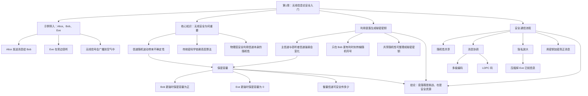

# 知识图解

## 知识结构图

## 图解说明
- 无线通信的天然特性是“广播到空气中”，因此 Eve 可能被动接收，这也是无线安全问题重要的根本原因。
- 课程的核心思想不是单纯依赖传统密码算法，而是利用信道的随机衰落，把“对 Bob 更有利的时刻”转化为安全机会。
- 保密容量刻画了信道在某次衰落下能否安全传输：Bob 强于 Eve 时才有正的安全速率，否则为 0。
- 机会式秘密密钥协商的主线是“先共享随机性，再协调一致，再隐私放大，最后用密钥保护消息”。
- 多级编码和 LDPC 码主要用于消息协调阶段，帮助 Bob 从带噪观测中恢复与 Alice 一致的随机序列。
- 总体结论是：衰落不只是噪声来源，也可以成为生成秘密密钥和实现物理层安全的资源。
