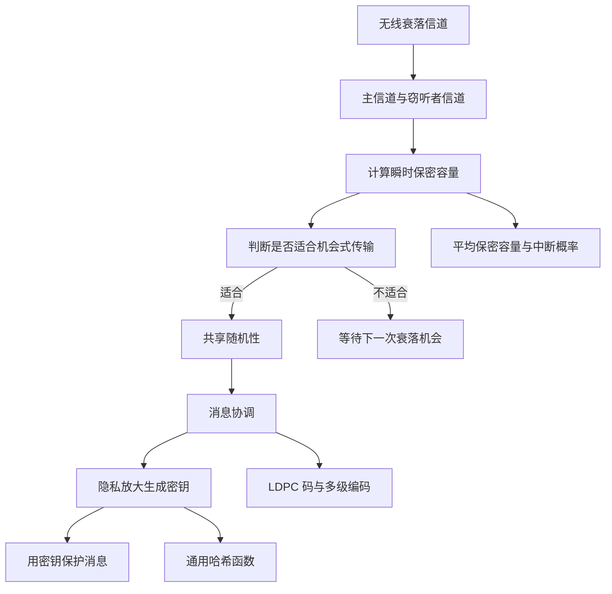

# Intermediate - 无线信息论安全与机会式密钥协商

> 本周内容聚焦于：如何利用无线信道的衰落特性，在有窃听者的情况下实现可靠且安全的通信，并进一步生成可用于加密的秘密密钥。

## 示例导入

假设 Alice 想在无线网络中给 Bob 发送一段重要消息，而 Eve 正在旁边被动监听。

如果 Alice 直接把消息发出去，Eve 可能也能收到。  
但如果这段无线信道出现了**衰落**，就会出现一种“有时 Bob 的信道比 Eve 更好、有时 Eve 的信道反而更好”的情况。

这时可以采用一个机会式策略：

1. **先不急着发消息**，而是挑选那些“Bob 明显比 Eve 更有优势”的时刻；
2. 在这些时刻，Alice 和 Bob 先发送一些随机符号，建立共享随机性；
3. 再用纠错信息把双方看到的随机值对齐；
4. 通过**隐私放大**把这些公共随机性压缩成秘密密钥；
5. 最后再用这个密钥保护真正的消息。

这样做的关键不是“把消息本身直接藏起来”，而是**先生成密钥，再用密钥保护消息**。  
本文资料的核心就是：在准静态衰落无线信道中，这种方法为什么可行、什么时候效果好、以及如何用 LDPC 码把它做得更实用。

## 核心知识

### 1. 无线信息论安全的基本思路

资料先从信息论安全的角度讨论无线通信中的保密问题。与传统“依赖算法难题”的密码学不同，这里关心的是：

- 信道本身是否提供了保密能力；
- 发送方和接收方能否利用信道随机性生成秘密；
- 即使窃听者存在，也能否保证信息论意义上的安全。

文中强调了两个背景：

- 传统 RSA、AES 等方法通常默认物理层链路可靠；
- 物理层安全则利用**信道随机性**来增强安全性。

### 2. 无线系统模型：主信道与窃听者信道

资料考虑的是两个独立的准静态 Rayleigh 衰落信道：

- **主信道**：Alice 到 Bob；
- **窃听者信道**：Alice 到 Eve。

对应的接收模型可以概括为：

- Bob 接收到的信号 = 衰落系数 × 发送信号 + 噪声；
- Eve 接收到的信号 = 另一组独立衰落系数 × 发送信号 + 噪声。

关键假设：

- 信道在一个码字传输期间保持不变，称为**准静态衰落**；
- 信道输入、衰落系数、噪声彼此独立；
- 发送功率受平均功率约束。

在这个模型中，瞬时信噪比由衰落系数决定，并且由于 Rayleigh 衰落，瞬时信噪比服从指数分布。

### 3. 保密容量：什么时候能安全传输

资料定义了**保密容量**，即在满足可靠通信的同时，Eve 无法获得有效信息时的最大传输速率。

对于一次具体的衰落实现，若主信道瞬时信噪比为 \(\gamma_m\)，窃听者信道瞬时信噪比为 \(\gamma_w\)，则瞬时保密容量为：

- 若 \(\gamma_m > \gamma_w\)，保密容量为 \(\log(1+\gamma_m)-\log(1+\gamma_w)\)；
- 若 \(\gamma_m \le \gamma_w\)，保密容量为 0。

这说明：

- **只有 Bob 的信道“比 Eve 更好”时，才有正的保密容量**；
- 一旦 Eve 的信道更好，安全通信速率就可能降为 0。

### 4. 平均保密容量：衰落的正面作用

资料进一步讨论了**平均保密容量**。由于衰落是随机的，所以即使某些时刻不安全，平均来看仍可能存在可用的安全速率。

重要结论是：

- 衰落并不只是“坏事”；
- 在某些条件下，即使 Eve 的平均 SNR 比 Bob 更高，**只要衰落造成足够波动，平均保密速率仍可能大于 0**。

这与传统高斯窃听信道形成对比：  
在没有衰落波动时，主信道通常必须在平均质量上优于窃听者，才能得到正保密容量。

### 5. 中断概率：安全速率是否会“掉线”

资料用**保密中断概率**来衡量系统在某个目标安全速率 \(R_s\) 下失败的概率：

- 若瞬时保密容量小于目标速率，就发生中断。

这很有实际意义：

- 它表示有多少比例的衰落时刻可以支持目标安全速率；
- 当 Alice 不了解 Eve 的信道状态时，也可以把它当作安全性指标。

资料给出了几个直观结论：

- \(R_s\) 越大，中断概率越高；
- Bob 的平均信噪比越高，中断概率越低；
- Eve 的平均信噪比越高，中断概率越高；
- 当 Bob 距离 Alice 更近、或路径损耗更小的时候，安全性更强。

### 6. 不完全信道状态信息（CSI）

现实中，Alice 往往无法准确知道 Eve 的信道。资料考虑了这种更现实的情况：

- Alice 对主信道 CSI 可以比较准确；
- 对窃听者信道 CSI 只有不完全估计。

文中指出，这时仍可用中断概率来分析协议性能。  
但如果 Alice 错误低估了 Eve 的信道，就可能误以为当前速率是安全的，结果出现“泄露风险”。

资料还给出了一个关于估计误差方差的上界分析，说明：

- 估计误差越大，Alice 越可能保守；
- 过于保守时，反而会更少冒险泄密；
- 但这会牺牲可用安全速率。

### 7. 机会式秘密密钥协商：四步法

这是资料的核心协议思想。  
它不是直接设计窃听码去传消息，而是先利用信道随机性生成密钥，再用密钥加密消息。

协议分四步：

1. **机会式随机性共享**  
   选择那些瞬时保密容量较高、且主信道条件足够好的时刻，发送随机符号，建立双方相关随机性。

2. **消息协调**  
   由于 Bob 接收到的是带噪版本，需要通过额外纠错信息把双方的随机序列对齐。

3. **隐私放大**  
   从已经协调好的公共随机序列中压缩出较短的秘密密钥，尽量消除 Eve 已知的信息。

4. **秘密密钥保护消息**  
   生成的密钥可用于一次一密或其他对称加密。

资料中定义了一个机会式传输的衰落集合：  
只有当保密容量和主信道容量同时满足某些阈值时，才执行随机性共享。

### 8. 实用算法：基于多级编码与 LDPC 码的协调

资料重点介绍了一个实用的协调算法，用来把 Alice 和 Bob 的相关随机序列对齐。

#### 8.1 为什么需要协调

Alice 和 Bob 虽然共享同一随机源，但 Bob 看到的是带噪版本，因此双方的序列并不完全一致。  
协调的任务就是：

- 发送尽可能少的附加信息；
- 让 Bob 恢复 Alice 的随机序列。

#### 8.2 Slepian-Wolf 压缩思想

资料把协调看成一种“带边信息的源编码”问题。  
核心结论是：所需的附加比特数至少与条件熵 \(H(X|Y_m)\) 同量级。

换句话说：

- Bob 已经有一部分信息；
- Alice 只需补充剩余不确定性；
- 补多少，取决于双方观测的相关程度。

#### 8.3 多级编码 / 多阶段译码

由于随机变量 \(X\) 不是简单二进制，而是更一般的星座符号，资料采用：

- **多级编码（多层比特表示）**
- **多阶段译码**

做法是：

- 把一个星座符号拆成多个比特层；
- 逐层发送校验信息；
- Bob 一层层恢复这些比特；
- 每层可用 LDPC 码实现。

#### 8.4 LDPC 码的作用

资料选择 LDPC 码，是因为它：

- 易于构造；
- 适合迭代译码；
- 在纠错和边信息编码中性能较好。

文中还说明：

- 每层的最优码率可以由链式法则推导；
- 不同层的码率要分别设计；
- 自然二进制映射通常是一个较好的折中。

#### 8.5 码率分配与 EXIT 分析

资料进一步提到：

- 可以用 EXIT 图分析解映射器与译码器之间的信息交换；
- 通过调整各层 LDPC 码率，平衡译码性能和泄露开销；
- 低码率层更容易收集信息，但会增加冗余；
- 高码率层更省开销，但更难译对。

### 9. 安全吞吐量与通信吞吐量

资料为了评价协议性能，引入了两个指标：

#### 平均 η-安全吞吐量
表示每个信道使用中，经过密钥保护后真正安全传输的平均密文比特数。  
这里的 \(\eta\) 表示“密钥比特与密文比特的比例”。

#### 平均 η-通信吞吐量
表示除去协调、隐私放大和加密开销后，实际还能额外承载的消息比特数。

这两个指标的意义在于：

- 安全密钥协商并不等于“纯传消息”；
- 密钥生成本身需要消耗信道资源；
- 所以必须同时看“安全能力”和“通信代价”。

### 10. 渐近性能：保密受限区与通信受限区

资料把系统性能分成两个典型区域：

#### 保密受限区
- 主信道很弱时；
- 安全能力主要被 Eve 限制；
- 此时协议可达到的安全吞吐量接近平均保密容量，但下界可能不够紧。

#### 通信受限区
- 主信道很强时；
- 系统主要受协调和消息交换开销限制；
- 安全吞吐量大致随 \(\log \gamma_m\) 增长；
- 说明即使主信道很好，密钥协商仍会有固定开销。

### 11. 不完全 CSI 下的真实安全吞吐量与泄露吞吐量

在实际中，Alice 对 Eve 的信道估计不准，会带来两个问题：

- 可能少生成了本可生成的密钥；
- 也可能低估泄露，生成不够安全的密钥。

因此资料进一步定义了：

- **真实平均安全吞吐量**
- **平均泄露吞吐量**

并引入一个安全裕度参数 \(\alpha\)：

- \(\alpha\) 越大，越保守；
- 泄露越小；
- 但生成的密钥也越少。

这说明：  
在不完全 CSI 下，系统设计本质上是在**安全性与速率之间做折中**。

## Mermaid 图

## 关键术语

- **信息论安全**：不依赖计算困难性，而是从信息量上保证窃听者无法恢复秘密。
- **保密容量**：在保证可靠且安全的前提下，信道能支持的最大传输速率。
- **平均保密容量**：对随机衰落信道所有实现取平均后的保密容量。
- **中断概率**：瞬时保密容量低于目标安全速率的概率。
- **准静态衰落**：在一个码字传输期间，信道衰落系数保持不变。
- **CSI（信道状态信息）**：对信道增益、衰落等状态的估计信息。
- **机会式传输**：只在信道条件合适时发送，以提高安全效率。
- **秘密密钥协商**：让双方从相关随机性中生成一致且保密的密钥。
- **协调**：通过额外纠错信息修正双方随机序列的差异。
- **隐私放大**：把部分泄露给窃听者的公共随机性压缩成更短但更安全的密钥。
- **LDPC 码**：低密度奇偶校验码，适合迭代译码与实用纠错。
- **Slepian-Wolf 定理**：带边信息源编码的理论基础，说明相关信息压缩所需的最少比特数。
- **Maxwell-Boltzmann 分布**：用于优化离散星座概率的一种分布形式，可逼近高斯输入性能。
- **EXIT 图**：用于分析迭代译码中信息传递与收敛趋势的工具。

## 常见误区

- **误区 1：只有 Bob 的平均信道比 Eve 好，才能安全。**  
  资料说明，在衰落信道里，即使平均上 Eve 更强，仍可能因瞬时波动得到非零保密容量。

- **误区 2：机会式传输就是“少发点消息”。**  
  其实它是选择信道状态合适的时刻，先共享随机性，再生成密钥。

- **误区 3：协调只是普通纠错。**  
  协调本质上是带边信息的源编码，需要考虑 Eve 可能知道的所有公开信息。

- **误区 4：隐私放大等于加密。**  
  隐私放大是从带泄露的共享随机性中提取秘密密钥，不是直接加密消息。

- **误区 5：不完全 CSI 一定意味着无法安全。**  
  资料表明，即使 CSI 不完美，只要设计得当，仍可获得有意义的安全密钥更新能力。

- **误区 6：LDPC 码只用于纠错。**  
  这里它还被用于秘密密钥协商中的协调阶段。

## 自测问题

- 为什么准静态衰落会提升无线信道的保密潜力？
- 瞬时保密容量为何在 \(\gamma_m \le \gamma_w\) 时为 0？
- 平均保密容量与中断概率分别反映了什么？
- 为什么机会式秘密密钥协商比直接设计窃听码更实用？
- 协调、隐私放大和最终加密这三步各自解决什么问题？
- Slepian-Wolf 定理在协调阶段起什么作用？
- 为什么资料要使用多级编码和 LDPC 码？
- 在不完全 CSI 下，为什么要引入安全裕度参数 \(\alpha\)？
- 保密受限区和通信受限区的区别是什么？
- 如果 Eve 的信道估计不准确，协议性能会如何变化？

如果你愿意，我还可以把这份讲义进一步整理成：
1. **课堂版提纲**，或者  
2. **考试复习版重点总结**。
