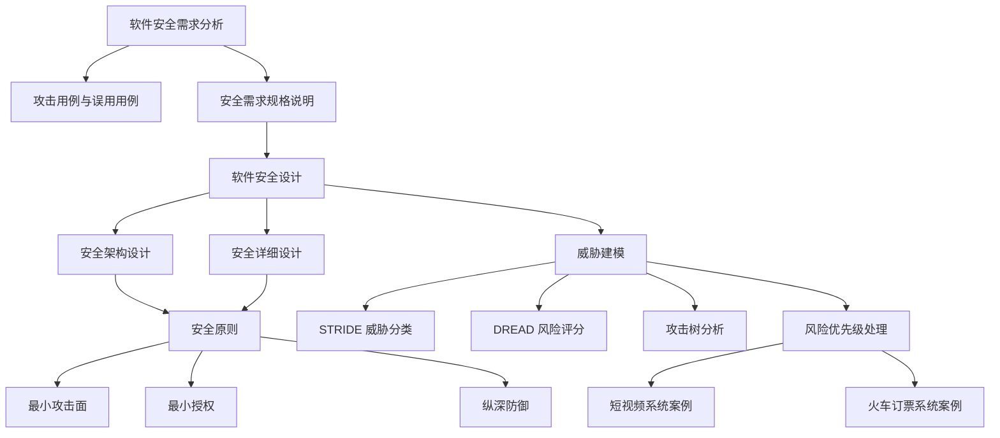

<think>**Assessing design implications**

I need to focus on tradeoffs, boundary conditions, and design implications when analyzing practical aspects and prioritizing risks. I'll be careful not to create facts and skip unnecessary jargon, only using phrases like "资料中未给出" when it feels appropriate. It's crucial to maintain clarity while still delivering concise yet complete insights. This way, I can provide valuable guidance without making assumptions or stepping outside the information I have.</think>

# Advanced - 软件安全分析与设计

> 本讲义帮助你把“安全”从口号落到需求、设计、建模和风险优先级上，理解如何在软件开发早期系统性减少漏洞与安全债务。

## 示例导入

假设你要开发一个“短视频社交系统”。

1. 先看业务目标：用户要上传、观看、评论、推荐视频，管理员要维护系统。
2. 如果只按“正常使用”写需求，往往会忽略攻击者会怎么滥用系统，例如伪造登录、批量刷接口、上传恶意内容、绕过权限查看他人数据。
3. 因此，需求分析不能只写“系统要支持上传视频”，还要补上：
   - 账户认证要可靠；
   - 敏感操作要可审计；
   - 会话不能被轻易冒用；
   - 配置和日志不能泄露隐私；
   - 失败登录要有控制策略。
4. 到设计阶段，如果系统默认开放很多接口、权限过大、日志缺失、会话可重放，那么即使功能正确，也可能在上线后被攻击者轻松利用。
5. 更进一步，设计者会用威胁建模把“可能被攻击的点”结构化地列出来，例如输入验证、认证、授权、会话管理、加密、异常处理、审计日志等，并按风险优先级处理。
6. 这就是本章的核心：把安全需求、设计原则和威胁建模串成一条线，尽量在开发早期发现并压低风险。

## 核心知识

### 一、软件安全需求分析：把“安全”纳入与功能同等层级的需求

软件需求分析的目标，不只是回答“系统做什么”，还要回答系统在安全、性能、可靠性、可用性、接口约束等方面必须满足什么要求。资料强调：**软件安全性需求是软件需求的重要组成部分，与业务功能需求处于同一需求水平，并对业务功能需求具有约束力**。

#### 1. 安全需求分析的主要任务

安全需求分析至少包括三类任务：

- **确定安全要求**
  - 需要构建尽可能完整、准确的安全需求规格说明。
  - 需要形成正式的书面安全计划，明确责任方与配合方。
- **确定质量门（缺陷等级）**
  - 用来规定安全与隐私质量的最低可接受标准。
  - 缺陷严重程度可分为：致命、严重、较重、一般、轻微。
  - 缺陷优先级可分为：紧急、正常、不急。
- **评估安全和隐私风险**
  - 识别系统中易受攻击部分的风险级别。
  - 资料给出的隐私风险分级为：P1（高）、P2（中）、P3（低）。

#### 2. 攻击用例与误用用例：从攻击者视角补全需求

普通用例默认用户在理想环境下正确使用系统，容易遗漏“被故意滥用”的场景。为补上这一块，资料引入了：

- **攻击用例**
  - 从攻击者角度看系统，分析其用于破坏软件产品的技术和目标。
  - 本质上是威胁分析的一种需求表达方式。
- **误用用例 / 滥用用例（Misuse Case / Abuse Case）**
  - 用负面场景建模系统的非预期行为。
  - 重点不是业务功能，而是“如果某个安全机制缺失或失效，会发生什么”。

#### 3. 误用用例的建模思路

资料给出的流程可以理解为“四步法”：

1. **定义正向安全需求**
   - 例如系统应该如何认证、授权、审计、保护隐私。
2. **定义反向安全需求**
   - 例如不满足安全要求时会造成什么后果。
3. **考虑所有可能获得系统访问权的用户**
   - 包括普通用户、管理员、外部攻击者、内部人员等。
4. **构建误用用例**
   - 以反向安全需求为基础，描述恶意用户可能如何滥用系统，并据此提炼安全需求。

#### 4. 这一阶段的重点边界

- 安全需求不是“补充项”，而是约束业务实现的前置条件。
- 若安全需求写得太晚，后续设计与编码会被迫返工。
- 需求分析阶段不追求穷尽所有攻击，但必须覆盖高价值资产和关键路径。

---

### 二、软件安全设计：把安全约束落实到架构、模块和数据结构

资料指出，很多安全问题并不是实现阶段“写错了代码”才出现，而是**设计阶段对安全性考虑不足**导致的。设计缺陷越晚发现，修复成本越高，因此必须在设计阶段重视安全。

#### 1. 软件安全设计的两个阶段

- **安全架构设计**
  - 根据功能和安全需求构建整体架构。
  - 对架构进行安全性分析和完善。
- **安全详细设计**
  - 对功能模块和数据结构进行细化设计。
  - 在细节层面考虑访问控制、会话、数据流、异常处理、日志等安全问题。

#### 2. 十个重要安全设计原则

资料列出的原则可视为安全架构的判断框架。它们之间并不总是兼容，实践中需要权衡。

##### 2.1 最小化攻击面原则

攻击面（Attack Surface）是用户、潜在攻击者和其他程序能够访问的软件功能与代码总和。攻击面越大，可被利用的入口越多。

常见做法包括：

- 关闭不需要对外开放的端口或功能；
- 减少默认可执行代码；
- 限制可访问代码的人员范围和身份；
- 提高执行某些代码所需的权限。

资料中的对比非常典型：

- 高攻击面：权限默认打开、打开 Socket、匿名访问、经常开放端口、可访问因特网。
- 低攻击面：权限默认关闭、关闭 Socket、认证后访问、只在需要时开放端口、仅访问本地子网。

这体现出一个工程事实：**默认开放通常比按需开放更危险**。

##### 2.2 最小授权原则

只授予用户或程序完成操作所必需的最小权限。

- 普通用户没有管理员权限时，能做的破坏更有限；
- 程序中只给需要特权的部分授予特权；
- 将特权有效时间限制到最短。

资料中的 Office 示例很有代表性：打开不可信来源文档时默认不可编辑、默认不可执行代码，即使存在缓冲区溢出漏洞，攻击者也更难直接执行恶意代码。

##### 2.3 权限分离原则

不要把所有权限集中到一个人或一个账号上，而要让多个不同身份协同完成敏感操作。

常见措施：

- 禁止 root 用户远程登录；
- 不同管理员分配不同权限；
- 高敏感操作要求多个管理员共同确认。

这类设计的价值在于：即使单点被攻破，也不容易直接获得全部控制权。

##### 2.4 纵深防御原则

不要把安全寄托于单一机制，而应采用多层防线。

- **防火墙**：阻断危险流量；
- **入侵检测系统（IDS）**：发现可疑行为并标识；
- **监控**：记录并分析系统事件，便于快速响应。

纵深防御的本质是：**即便一层被绕过，后续层仍能提供缓冲与告警**。

##### 2.5 默认安全配置原则

系统初始状态应尽量安全，避免用户在不了解配置时暴露风险。

常见措施：

- 默认拒绝请求；
- 默认关闭不常用功能；
- 默认检查口令复杂性；
- 达到最大登录尝试次数后锁定账户。

这项原则特别适合“上线即暴露于互联网”的系统。

##### 2.6 完全控制原则

对受保护对象的任何访问都要进行授权检查，并能标识请求来源。

要特别注意缓存场景：为了性能缓存的访问路径，可能成为绕过身份验证的漏洞入口，因此也要做细粒度授权检查。

##### 2.7 开放设计原则

安全机制不应依赖“设计秘密”来维持安全。

资料明确指出：

- 不能把系统安全寄托于算法保密；
- 应使用标准、经过验证的算法，例如 RSA、AES；
- 数据安全应依赖密钥等受保护元素的保密性，而不是算法本身的隐藏。

这说明：**安全应建立在可公开审查的机制上，而不是“别人不知道所以安全”**。

##### 2.8 保护最弱环节原则

攻击者通常会寻找最薄弱的一环突破，而不是攻击最强的部分。

因此，设计者需要：

- 对方案做全面风险分析；
- 找出最容易被利用的风险；
- 按严重程度排序并优先处理。

这也是为什么“总体最强”并不等于“整体安全”。

##### 2.9 安全机制的经济性原则

越复杂的系统通常攻击面越大、薄弱环节越多、维护成本越高。

所以安全机制要尽可能简洁，降低实现与维护成本。这里的关键不是“越少越好”，而是“足够安全且不过度复杂”。

##### 2.10 安全机制心理可接受原则

安全机制要尽量符合用户习惯，不能明显降低可用性，否则用户可能关闭、绕过或抵触安全设置。

这是一条典型的工程平衡原则：  
**安全如果严重破坏可用性，最终往往会在真实环境中失效。**

#### 3. 原则之间的权衡

资料特别提醒：这十项原则在一个系统里**不一定能同时完全满足**，有些甚至彼此冲突。实际设计要做取舍，优先保障重要安全需求或总体安全需求。

可以理解为：

- 安全性、可用性、性能、维护成本之间常有张力；
- 设计不是选择“最安全的理论方案”，而是选择“风险可控、成本可接受、可长期运行的方案”。

---

### 三、软件安全设计的方法与模式：把原则变成可落地的结构

#### 1. 常见方法：面向 Web 应用的安全设计策略

资料列举了几种常见做法：

- **服务器端验证**
  - 不信任客户端输入。
  - 客户端提交的数据必须经过服务器验证后才能处理。
- **分页传输数据**
  - 大批量数据分页传输，减少一次性资源消耗，提升性能并降低风险。
- **使用安全协议传输**
  - 资料列举了 SSL、HTTPS、SET 等协议。
- **会话管理**
  - 会话对象用完后应及时删除和释放，防止被冒用身份发起攻击。

这里的共同点是：**安全设计不只是“加一个功能”，而是控制数据在传输、存储、会话生命周期中的暴露面**。

#### 2. 五种常见安全设计模式

资料给出五类常见模式，可视为安全架构的模板：

- **认证器模式**
  - 用于验证访问者是否是其声称的身份。
  - 关注点：用户或系统鉴别。
- **基于角色的访问控制模式**
  - 基于人的任务分配功能与权限。
  - 关注点：访问控制。
- **安全的 MVC 模式**
  - 在 MVC 结构上增强用户交互安全性。
  - 关注点：系统交互。
- **传输层安全 VPN 模式**
  - 用隧道与加密建立安全通道，并对端点进行鉴别和访问控制。
  - 关注点：安全通信。
- **安全日志与审计模式**
  - 记录并分析用户行为。
  - 关注点：审计。

#### 3. 基于安全模式的设计流程

资料把设计流程分为三阶段：

1. **风险评估**
   - 包括风险识别、风险评估和风险描述。
2. **安全模式选取**
   - 包括模式选取、模式评估、系统框架重构。
3. **安全模式细化**
   - 将安全模式实例化到具体框架中；
   - 根据加入模式后的系统框架和业务需求，重构业务类图并生成详细设计类图。

这个流程的意义是：  
**先判断风险，再选结构，再落到类图与实现**，避免“先做系统再补安全”。

---

### 四、威胁建模：把潜在威胁结构化、分类化、优先级化

威胁建模是识别、分类和分析软件潜在威胁的形式化方法。它可以贯穿软件开发生命周期，但在不同阶段的作用不同。

#### 1. 威胁建模的作用

- 减少与安全相关的设计缺陷和编码缺陷；
- 降低残留安全缺陷的严重程度；
- 减小软件整体安全风险。

#### 2. 按关注对象划分的三种建模思路

- **关注资产**
  - 资产是有价值的东西，也是攻击者想要的东西。
  - 理论上合理，但资料指出实际效果不一定理想。
- **关注攻击者**
  - 识别潜在攻击者的身份、组织或个人特征，再推导威胁。
- **关注软件**
  - 实际中最常用，因为更容易落到具体系统结构、数据流和边界上。

#### 3. 按应用阶段划分：主动式与被动式

- **主动式建模（防御式建模）**
  - 常用于开发早期，尤其是规格和设计阶段。
  - 缺点：早期难以预测所有威胁。
- **被动式建模（对抗式建模）**
  - 常用于产品部署后，帮助发现已存在的问题。
  - 缺点：需要打补丁，可能影响用户体验，而且未必比主动式更有效。

实践中通常是：

- 设计阶段尽量用主动式建模提前预判；
- 后期再用被动式建模修补未预见威胁。

#### 4. 主流威胁建模方法：STRIDE 与攻击树

##### 4.1 STRIDE

STRIDE 是微软提出的成熟威胁建模方法，包含六类威胁：

- **Spoofing（假冒）**：冒充某人或某物；
- **Tampering（篡改）**：未经授权修改数据；
- **Repudiation（抵赖）**：否认自己的攻击行为；
- **Information Disclosure（信息泄露）**：敏感信息被未授权访问；
- **Denial of Service（拒绝服务）**：系统无法正常提供服务；
- **Elevation of Privilege（权限提升）**：获得本不该有的权限。

资料还提到升级版 **ASTRIDE**，新增了 **Privacy（隐私）** 威胁类型。

##### 4.2 DREAD

DREAD 是 STRIDE 的附属评价框架，用于评估威胁级别，包含五个维度：

- **破坏力（Damage potential）**
- **可重复攻击性（Reproducibility）**
- **漏洞利用难度（Exploitability）**
- **影响用户数（Affected users）**
- **漏洞隐蔽程度（Discoverability）**

它的作用不是替代 STRIDE，而是帮助排序：  
**先处理破坏力大、易复现、易利用、影响范围广、且容易发现的威胁。**

##### 4.3 攻击树

攻击树是对系统攻击的一种分类建模方法，用树结构描述攻击逻辑。

- **根节点**：最终攻击目标；
- **叶节点**：具体攻击事件；
- **中间节点**：中间步骤或子目标；
- **AND 节点**：必须同时满足多个步骤；
- **OR 节点**：多个步骤任选其一。

资料中的例子提到了：

- 网络钓鱼；
- 暴力破解；
- 密码喷洒；
- 利用 WebMail 访问公司邮件；
- 找到漏洞并获取 WebMail 软件。

攻击树的价值在于把“攻击路径”显式化，便于分析拦截点和最短突破路径。

---

### 五、案例分析：把方法落到具体系统上

#### 1. 短视频社交系统的安全需求分析

资料将该系统的安全需求分为三类：

- **核心安全需求**
  - 保密性
  - 完整性
  - 可用性
  - 可认证
  - 授权
  - 监控与审计
- **通用安全需求**
  - 安全架构
  - 会话管理
  - 控制重复提交
  - 配置参数管理
- **运维安全需求**
  - 环境部署
  - 归档
  - 登录控制

这个分类体现出一个重要思路：  
**安全需求不只是“功能级别的认证授权”，还包括运行期、运维期和审计期要求。**

#### 2. Web 火车订票系统的威胁建模

资料给出了一个较完整的建模示例，步骤清晰，适合复用到其他 Web 系统。

##### 步骤 1：明确安全目标

包括：

- 登录安全
- 数据安全
- 支付安全
- 审计安全
- 响应安全

##### 步骤 2：系统概要分析

系统关键流程包括：

- 用户登录；
- 前端初步验证后发送账号和密码到后台数据库比对；
- 查询车次；
- 有余票时下单并支付；
- 管理员可维护车次、站点等信息。

##### 步骤 3：系统功能分解

资料把系统拆成了多个模块，例如：

- 登录验证模块；
- 订票模块；
- 设置车票模块。

在威胁建模中，这一步非常关键，因为**威胁通常落在模块边界、数据流和信任边界上**。

##### 步骤 4：确定威胁

资料列出的常见威胁及对应缓解点包括：

- 输入验证：缓冲区溢出、SQL 注入、XSS
- 认证：网络窃听、暴力攻击、字典攻击、Cookie 重播、凭证偷窃
- 授权：泄露机密数据、篡改数据
- 配置管理：检索配置数据、未授权访问管理界面和配置文件
- 敏感信息：访问敏感数据、网络窃听、篡改数据
- 会话管理：会话劫持、会话重播、中间人攻击
- 加密：破解算法、破解密钥
- 参数操纵：查询字符串、表单、Cookie、HTTP 头操纵
- 异常管理：拒绝服务、泄露系统信息
- 审计和日志：用户抵赖操作、掩盖踪迹

##### 步骤 5：制定缓解计划并排序

资料明确给出了风险优先级排序示例，思路是先处理高风险威胁：

1. 基于字典的暴力破解
2. SQL 注入
3. 凭证偷窃
4. 网络窃听
5. 拒绝服务
6. Cookie 重播或捕获
7. XSS 注入
8. 用户抵赖与掩盖踪迹

这里的关键不是背顺序，而是理解排序依据：

- 是否影响身份认证和核心数据；
- 是否能直接获得控制权或敏感信息；
- 是否容易被批量自动化利用；
- 是否会影响大量用户或核心服务。

---

## 结构关系图

## 关键术语

- **软件安全需求**：与业务需求同层级的安全约束，决定系统必须满足的认证、授权、审计、隐私与防护要求。
- **攻击用例**：从攻击者视角描述系统如何被利用的需求表达方式。
- **误用用例（滥用用例）**：用负面场景建模系统的非预期行为，以发现安全需求。
- **攻击面（Attack Surface）**：外部可接触的功能、接口和代码总和，越大越危险。
- **最小授权原则**：只给完成任务所必需的最小权限。
- **权限分离原则**：将敏感权限拆分给多个角色协作完成。
- **纵深防御（Defense-in-Depth）**：用多层安全机制共同防护，而不是依赖单一手段。
- **默认安全配置**：系统初始状态尽量安全，避免“开箱即暴露”。
- **完全控制原则**：对受保护对象的每次访问都应授权并可追溯。
- **STRIDE**：六类威胁模型，涵盖假冒、篡改、抵赖、信息泄露、拒绝服务、权限提升。
- **DREAD**：用于评估威胁严重程度的五维度方法。
- **攻击树**：用树结构表示攻击目标、步骤与组合关系的威胁分析方法。

## 常见误区

- 把安全需求当成“非功能补充”，而不是和业务需求同等重要的约束。
- 只写“系统要安全”，却没有具体到认证、授权、会话、审计、配置等可落实项。
- 认为安全设计可以上线后再补，忽视设计缺陷的修复成本远高于早期预防。
- 只做功能测试，不做攻击视角下的误用用例或威胁建模。
- 认为“用了加密就安全”，忽略密钥管理、会话管理、权限控制和日志保护。
- 把某一项原则绝对化，例如只追求最小攻击面，却忽略可用性和运维成本。
- 只看外部攻击，不考虑内部人员、管理员权限、配置文件和日志泄露等风险。
- 只列威胁，不排序；结果是资源浪费在低风险问题上，而高风险漏洞未优先处理。

## 自测问题

- 为什么说软件安全需求与业务功能需求处于同一层级？
- 普通用例和误用用例在关注点上有什么本质区别？
- 最小授权原则和权限分离原则分别解决什么风险？
- 为什么“开放设计”比“依赖算法保密”更可靠？
- 纵深防御为什么比单一防线更适合真实系统？
- STRIDE 的六类威胁分别是什么？各自对应什么攻击意图？
- DREAD 的五个维度分别衡量什么，为什么它适合做优先级排序？
- 攻击树中的 AND 和 OR 节点分别表示什么含义？
- 在火车订票系统中，为什么 SQL 注入和弱密码通常比某些低频威胁更应优先处理？
- 如果你要为一个新 Web 系统做威胁建模，应该先从哪些模块和边界开始分析？
