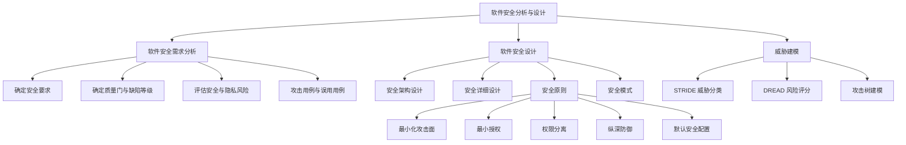

# Beginner - 软件安全分析与设计

> 本讲义帮助你理解：软件在“做出来之前”如何先把安全需求想清楚、把安全设计做好，并学会用威胁建模发现潜在风险。

## 示例导入

假设你要开发一个“短视频社交系统”。如果只考虑“能上传视频、能看视频”，系统可能很快就能做出来；但如果没有提前考虑安全问题，可能会出现这些情况：

1. 攻击者用伪造账号登录系统。
2. 用户密码明文传输，被网络窃听。
3. 上传内容中夹带恶意脚本，引发跨站脚本攻击。
4. 日志没有保存好，出了问题也无法追查。
5. 某些管理员权限太大，一旦账号泄露，整个系统都可能被控制。

所以，软件开发不能只关注“功能能不能用”，还要在需求分析阶段明确“系统必须安全地做什么”，在设计阶段把安全机制融入架构与模块中。  
本章讲的就是这件事：**先分析安全需求，再进行安全设计，最后通过威胁建模找出风险并制定缓解措施。**

---

## 核心知识

### 一、软件安全需求分析是什么

软件需求分析的目标，是弄清楚系统“必须做什么”。  
除了功能、性能、可靠性、可用性等需求，**安全需求**也是需求的一部分，而且和业务功能需求处于同一层级，对业务功能有约束作用。

#### 1. 软件需求分析的基本任务
资料中提到，需求分析通常要完成这些事：

- 确定系统的综合要求  
  包括功能、安全性、性能、可靠性、可用性、出错处理、接口、逆向等要求，以及开发时必须遵守的限制条件。
- 确定系统的数据要求  
  可以用图形工具更直观地表示数据结构。
- 导出系统逻辑模型  
  例如数据流图、实体-联系图、状态转换图等。
- 修正系统开发计划  
  根据分析结果调整开发安排。

#### 2. 安全需求分析的主要任务
安全需求分析重点关注三件事：

- **确定安全要求**  
  明确系统应该具备哪些安全能力，例如认证、授权、隐私保护、审计等。
- **确定质量门和缺陷等级**  
  规定安全和隐私质量的最低可接受标准。
- **评估安全和隐私风险**  
  判断系统哪些部分更容易受到攻击，风险有多高。

#### 3. 缺陷严重程度与优先级
资料中给出了两个容易混淆的概念：

- **严重程度**：缺陷对系统质量破坏有多大  
  例如：致命、严重、较重、一般、轻微。
- **优先级**：先处理哪个缺陷  
  例如：紧急、正常、不急。

简单说：

- 严重程度回答“这个问题有多危险”
- 优先级回答“这个问题先修哪个”

#### 4. 风险等级
资料中提到安全风险评估可分为：

- P1：高隐私风险
- P2：中隐私风险
- P3：低隐私风险

---

### 二、攻击用例与误用用例

普通需求分析通常假设用户在理想环境下正常使用系统。  
但安全需求分析不能只看“正常使用”，还要考虑“被故意滥用”的情况。

#### 1. 攻击用例是什么
攻击用例关注的是：

- 攻击者想达到什么目标
- 攻击者可能用什么技术破坏软件
- 系统在哪些地方容易被滥用

它的核心思想是：**从攻击者角度看系统**。

#### 2. 用例与误用用例
- **正常用例**：描述用户预期的正常操作流程。
- **误用用例（Misuse Case / Abuse Case，滥用用例）**：描述恶意用户或异常行为如何破坏系统。

误用用例的作用：

- 帮助识别安全需求
- 发现系统可能遭受的威胁
- 说明当某个安全功能缺失或失效时会造成什么后果

#### 3. 安全需求分析的步骤
资料给出的典型步骤如下：

1. 确定正向安全需求  
   即软件应该完成哪些安全功能、允许哪些安全行为。
2. 创建反向安全需求  
   即软件不满足安全需求时会有什么后果。
3. 考虑所有可能获得系统访问权的用户。
4. 构建误用用例  
   结合攻击模式，描述恶意用户可能如何滥用系统。

---

### 三、软件安全设计是什么

安全需求只是“应该安全”，而安全设计回答的是：**怎么把安全真正做进系统里**。

软件设计阶段的任务是依据需求规格设计软件结构和数据结构。  
很多安全问题并不是编码时才出现，而是**设计阶段就埋下了缺陷**。  
而且越往后发现设计缺陷，修复成本越高，所以必须在设计阶段重视安全。

#### 1. 软件安全设计的两个阶段
资料将软件安全设计分为两个阶段：

- **软件安全架构设计**
  - 根据功能和安全需求先搭建系统总体架构
  - 再对架构做安全分析和完善
- **软件安全详细设计**
  - 对功能模块和数据结构做更细的设计
  - 同时考虑安全问题

---

### 四、软件安全设计的主要原则

资料列出了十个安全设计原则。初心者可以先把它们理解成：**让系统更难被攻击、更难被误用、同时不让正常用户太痛苦**。

#### 1. 最小化攻击面原则
攻击面（Attack Surface）指用户、潜在攻击者和其他程序能接触到的所有软件功能和代码的总和。

做法：

- 关闭不需要对外开放的端口
- 减少可执行代码量
- 限制可访问代码的人群和身份
- 提高执行代码所需权限

简单理解：**能少暴露就少暴露**。

#### 2. 最小授权原则
只给用户或程序完成任务所必需的最小权限。

做法：

- 只给程序需要特权的部分授予特权
- 只授予必需权限
- 尽量缩短特权有效时间

例子：  
新版本 Office 在打开不可信文档时，默认不允许编辑，也默认不执行代码。这样即使存在缓冲区溢出漏洞，攻击者也更难执行恶意代码。

#### 3. 权限分离原则
不要把所有权限都交给一个人或一个账号。

做法：

- 不允许 root 远程登录
- 不同管理员分配不同权限
- 某些敏感操作要求两个不同权限的人协同执行

这样做是为了避免“一个账号被攻破，整个系统都失守”。

#### 4. 纵深防御原则
不要只依赖一种防御手段，而要用多层防护。

常见措施：

- **防火墙**：阻断外部威胁
- **入侵检测系统（IDS）**：监控可疑行为，不一定阻止，但会识别
- **监控与日志**：记录并分析系统操作，帮助快速响应

可以理解为：  
**外层拦、内层查、事后还能追踪。**

#### 5. 默认安全配置原则
在用户还不熟悉配置选项时，系统默认就应该是比较安全的状态。

做法：

- 默认拒绝请求
- 默认关闭不常用功能
- 默认检查口令复杂性
- 多次登录失败后默认锁定账户

#### 6. 完全控制原则
对受保护对象的任何访问都要检查授权，并且要能识别操作请求来源。  
即使有缓存，也不能让攻击者绕过身份验证。

#### 7. 开放设计原则
安全机制不应该依赖“保密设计”来维持安全。

资料中的典型反例是：**私有加密算法**。  
正确做法是使用标准算法，例如 RSA、AES 等。  
安全性应依赖密钥等受保护元素，而不是算法本身“没人知道”。

#### 8. 保护最弱环节原则
攻击者常常会找系统中最薄弱的地方下手，而不是最强的地方。

做法：

- 全面分析风险
- 找出最容易被利用的点
- 按严重程度排序，优先处理高风险问题

#### 9. 安全机制的经济性原则
系统越复杂，安全风险通常越高。  
所以安全机制要尽量简洁，方便维护、测试和修复。

#### 10. 安全机制心理可接受原则
安全机制要尽量符合用户习惯，不能给合法用户增加太多麻烦。  
否则用户可能会主动关闭或绕过安全措施，反而失去保护效果。

---

### 五、软件安全设计的方法与模式

资料以 Web 应用为例，列出了一些常见设计方法和模式。

#### 1. 常见设计方法
- **服务器端验证**  
  任何来自客户端的输入都不可信，必须在服务器端验证后再处理。
- **分页传输数据**  
  大量数据不要一次性传输，按页处理以节省资源、提高性能。
- **使用安全协议传输**  
  如 SSL、HTTPS、SET 等。
- **会话管理**  
  使用完会话对象后及时删除并释放，防止被冒用。

#### 2. 五种常见安全设计模式
资料中列出了以下模式：

- **认证器模式**  
  验证访问者是否真的是他声称的身份。
- **基于角色的访问控制模式**  
  按角色分配功能和权限。
- **安全的 MVC 模式**  
  在 MVC 系统中增强用户交互安全。
- **传输层安全 VPN 模式**  
  通过隧道和加密建立安全通道，并进行端点鉴别与访问控制。
- **安全日志与审计模式**  
  记录用户行为，并对日志进行分析。

#### 3. 安全设计流程
基于安全模式进行设计时，一般有三个阶段：

1. **风险评估**
   - 风险识别
   - 风险评估
   - 风险描述
2. **安全模式选取**
   - 选择合适模式
   - 评估模式
   - 重构系统框架
3. **安全模式细化**
   - 将模式具体实例化
   - 在系统设计类图中体现出来
   - 根据业务需求重构设计

---

### 六、威胁建模

威胁建模是识别、分类和分析软件潜在威胁的形式化方法。  
它可以贯穿软件开发生命周期。

#### 1. 威胁建模的作用
- 减少安全相关的设计缺陷
- 减少编码缺陷
- 降低残留安全缺陷的严重程度
- 降低整体安全风险

#### 2. 按关注对象分类
资料中提到三类威胁建模：

- **关注资产**
  - 以有价值的东西为中心
  - 但实际效果不一定最好
- **关注攻击者**
  - 通过识别攻击者来推测威胁
- **关注软件**
  - 实际中最常用
  - 更直接地分析系统本身的风险

#### 3. 按应用阶段分类
- **主动式建模（防御式建模）**
  - 多用于开发早期
  - 优点：能尽早发现威胁
  - 缺点：早期不容易预测全部威胁
- **被动式建模（对抗式建模）**
  - 多用于产品发布后
  - 优点：能发现上线后的安全缺陷
  - 缺点：需要更新或打补丁，影响体验

实际开发中通常两者结合：  
**设计阶段尽量多预测，部署后继续修补。**

---

### 七、两种主流威胁建模方法

#### 1. STRIDE
STRIDE 是微软提出的系统安全威胁建模方法，包含六类威胁：

- **假冒（Spoofing）**：冒充某人或某物
- **篡改（Tampering）**：未经授权修改数据
- **抵赖（Repudiation）**：否认自己的攻击行为
- **信息泄露（Information Disclosure）**：敏感信息被未授权访问
- **拒绝服务（Denial of Service）**：系统无法正常提供服务
- **权限提升（Elevation of Privilege）**：获得本不该有的权限

资料还提到升级版本 **ASTRIDE**，增加了 **隐私（Privacy）** 威胁类型。

#### 2. DREAD
DREAD 是 STRIDE 的附件，用来评价威胁等级，包含五个维度：

- **破坏力**
- **可重复攻击性**
- **漏洞利用难度**
- **影响用户数**
- **漏洞隐蔽程度**

它的作用是帮助判断：  
**哪些威胁更严重，应该先处理。**

#### 3. 攻击树
攻击树是用树结构描述攻击逻辑的方法。

- **根节点**：攻击者最终目标
- **叶节点**：具体攻击事件
- **中间节点**：达成目标所需的中间步骤
- **AND 节点**：多个条件都要满足
- **OR 节点**：多个条件满足其一即可

常见例子包括：

- 暴力破解
- 密码喷洒
- 网络钓鱼
- 利用 WebMail 获取公司邮件

---

### 八、实例：短视频社交系统的安全需求分析

资料中的短视频社交系统例子，展示了如何把安全需求分层。

#### 1. 系统用户
- 经常性用户：
  - 短视频观众
  - 视频创作者
  - 系统管理员
- 间隔性用户：
  - 系统维护人员

#### 2. 系统目标
- 满足娱乐需求
- 符合相关内容要求
- 提供良好交互界面
- 向移动终端提供稳定流畅的视频
- 支持社区互动
- 跟踪用户偏好并进行推荐

#### 3. 安全需求分类
- **核心安全需求**
  - 保密性
  - 完整性
  - 可用性
  - 可认证
  - 授权
  - 监控与审计
- **通用安全需求**
  - 安全架构
  - 会话管理
  - 控制重复提交
  - 配置参数管理
- **运维安全需求**
  - 环境部署
  - 归档
  - 登录控制

这个例子说明：安全需求不是单点功能，而是贯穿系统整体的要求。

---

### 九、实例：火车订票系统的威胁建模

资料还给出了一个基于 Web 的火车订票系统案例。

#### 1. 安全目标
- 登录安全
- 数据安全
- 支付安全
- 审计安全
- 响应安全

#### 2. 系统概要
用户可以：

- 登录
- 查询车次
- 在有余票时下单
- 支付后创建订单并减少余票

管理员还可以：

- 设置车票信息
- 管理车次和站点

#### 3. 常见威胁与缓解措施
资料列出了一些典型威胁：

- 输入验证不足：缓冲区溢出、SQL 注入、XSS
- 认证问题：网络窃听、暴力攻击、字典攻击、Cookie 重播、凭证偷窃
- 授权问题：泄露机密数据、篡改数据
- 配置管理问题：未授权访问管理界面和配置文件
- 会话管理问题：会话劫持、会话重播、中间人攻击
- 加密问题：破解算法、破解密钥
- 参数操纵：查询字符串、表单、Cookie、HTTP 头被篡改
- 异常管理：拒绝服务、泄露系统信息
- 审计和日志：用户抵赖操作、掩盖踪迹

#### 4. 风险排序示例
资料给出的高优先级威胁包括：

1. 基于字典的暴力破解
2. SQL 注入
3. 凭证偷窃
4. 网络窃听
5. 拒绝服务
6. Cookie 重播或捕获
7. XSS 注入
8. 用户抵赖操作

这说明威胁建模不仅要“找威胁”，还要“排优先级”，先处理最危险的。

---

## Mermaid 图

---

## 关键术语

- **软件安全需求**：软件在安全方面必须满足的要求，例如认证、授权、审计、隐私保护等。
- **质量门**：安全和隐私质量的最低可接受标准。
- **缺陷严重程度**：某个缺陷对软件功能和性能破坏的程度。
- **攻击用例**：从攻击者角度描述如何破坏系统的用例。
- **误用用例（滥用用例）**：描述系统被恶意或非预期使用的场景。
- **攻击面（Attack Surface）**：外部能接触到的功能、接口和代码总和。
- **最小授权原则**：只给完成任务所必需的最少权限。
- **权限分离原则**：不要把全部权限集中给一个人或一个账号。
- **纵深防御**：使用多层安全机制共同防御。
- **防火墙（Firewall）**：用于阻断不安全网络访问的边界防护机制。
- **入侵检测系统（IDS）**：用于监控和识别可疑或非法行为的系统。
- **STRIDE**：一种威胁分类方法，包括假冒、篡改、抵赖、信息泄露、拒绝服务、权限提升。
- **DREAD**：用于评估威胁等级的五维方法。
- **攻击树**：用树结构描述攻击目标与攻击路径的方法。

---

## 常见误区

- **只做功能需求，不做安全需求**  
  安全需求不是附加项，而是需求的一部分。
- **把“严重程度”和“优先级”混为一谈**  
  严重程度看危害大小，优先级看处理顺序。
- **认为用户输入默认可信**  
  资料明确强调：客户端输入都应视为不可信。
- **把安全设计只理解为加密**  
  安全设计还包括权限、会话、日志、架构、默认配置等。
- **过度依赖单一防护措施**  
  纵深防御强调多层防护，而不是只靠一个防火墙。
- **以为“算法保密”就能保证安全**  
  正确做法是使用公开标准算法，安全依赖密钥等受保护元素。
- **只在上线后才考虑威胁**  
  早期设计阶段就应使用主动式威胁建模。

---

## 自测问题

- 为什么软件安全需求和业务功能需求一样重要？
- 攻击用例和正常用例有什么区别？
- 误用用例在安全需求分析中有什么作用？
- 什么是攻击面？为什么要尽量缩小攻击面？
- 为什么最小授权原则能降低风险？
- 纵深防御为什么比单一防御更可靠？
- STRIDE 的六种威胁分别是什么？
- DREAD 用来评估威胁的哪些方面？
- 攻击树中根节点、叶节点和中间节点分别表示什么？
- 火车订票系统中，SQL 注入、Cookie 重播、拒绝服务分别属于哪类安全问题？

如果你愿意，我也可以把这份讲义进一步整理成：
1. **课堂复习版提纲**，或  
2. **考试背诵版重点总结**。
