# 知识图解

## 知识结构图

```mermaid
flowchart TD
    A["第 2 周：软件安全分析与设计"] --> B["示例导入：短视频社交系统"]
    A --> C["核心知识"]
    C --> D["一、软件安全需求分析是什么"]
    C --> E["二、攻击用例与误用用例"]
    C --> F["三、软件安全设计是什么"]
    C --> G["四、软件安全设计原则"]
    C --> H["五、软件安全设计的方法与模式"]
    C --> I["六、威胁建模"]

    B --> B1["仅有功能需求不够"]
    B --> B2["还要考虑伪造登录、窃听、恶意脚本、日志追查、权限过大"]
    B2 --> D

    D --> D1["需求分析不仅看功能，也看安全性、隐私、可靠性、可用性等"]
    D --> D2["主要任务：确定安全要求"]
    D --> D3["主要任务：确定质量门与缺陷等级"]
    D --> D4["主要任务：评估安全和隐私风险"]
    D --> D5["区分严重程度与优先级"]
    D --> D6["风险等级：P1、P2、P3"]

    E --> E1["正常用例：描述正常操作流程"]
    E --> E2["误用用例：描述恶意或异常行为"]
    E --> E3["从攻击者视角发现安全需求"]
    E --> E4["步骤：正向安全需求"]
    E --> E5["步骤：反向安全需求"]
    E --> E6["步骤：考虑所有访问者"]
    E --> E7["步骤：构建误用用例"]

    F --> F1["安全设计回答：怎么把安全真正做进系统"]
    F --> F2["阶段一：安全架构设计"]
    F --> F3["阶段二：安全详细设计"]
    F --> F4["设计越晚发现缺陷，修复成本越高"]

    G --> G1["最小化攻击面"]
    G --> G2["最小授权"]
    G --> G3["权限分离"]
    G --> G4["纵深防御"]
    G --> G5["默认安全配置"]
    G --> G6["完全控制"]
    G --> G7["开放设计"]
    G --> G8["保护最弱环节"]
    G --> G9["经济性"]
    G --> G10["心理可接受"]
    G1 --> G1a["少暴露入口、少开放端口、少放大权限"]
    G2 --> G2a["只给完成任务所必需的最小权限"]
    G3 --> G3a["多个身份协同，避免单点失守"]
    G4 --> G4a["防火墙、IDS、监控与日志多层防护"]
    G5 --> G5a["默认拒绝、默认关闭、默认更安全"]
    G6 --> G6a["任何访问都要检查授权与来源"]
    G7 --> G7a["安全不依赖保密设计，依赖标准机制与密钥"]
    G8 --> G8a["优先处理最薄弱、最易被利用的环节"]
    G9 --> G9a["机制尽量简洁，便于维护与修复"]
    G10 --> G10a["减少用户负担，避免被绕过"]

    H --> H1["服务器端验证"]
    H --> H2["分页传输数据"]
    H --> H3["使用安全协议传输"]
    H --> H4["会话管理"]
    H --> H5["五种常见安全设计模式"]
    H5 --> H5a["认证器模式"]
    H5 --> H5b["基于角色的访问控制模式"]
    H5 --> H5c["安全的 MVC 模式"]
    H5 --> H5d["传输层安全 VPN 模式"]
    H5 --> H5e["安全日志与审计模式"]
    H --> H6["安全设计流程：风险评估 -> 选取模式 -> 细化模式"]

    I --> I1["形式化识别、分类、分析潜在威胁"]
    I --> I2["目标：减少设计缺陷、编码缺陷和整体安全风险"]
    I --> I3["可贯穿软件开发生命周期"]

    D --> F
    E --> I
    G --> H
```

## 图解说明
- 软件安全分析与设计的主线是：**先提安全需求，再做安全设计，最后通过威胁建模发现风险**。
- 安全需求分析不仅看功能，还要明确**安全要求、质量门、缺陷等级和风险等级**。
- **正常用例**描述系统如何被正常使用，**误用用例**则从攻击者视角补全安全需求。
- 安全设计分为**架构设计**和**详细设计**，越早把安全纳入设计，后期返工成本越低。
- 十条安全设计原则共同指向一个目标：**减少暴露、限制权限、叠加防护、优先处理最弱环节**。
- 威胁建模把潜在攻击结构化，有助于贯穿开发生命周期并降低整体安全风险。
