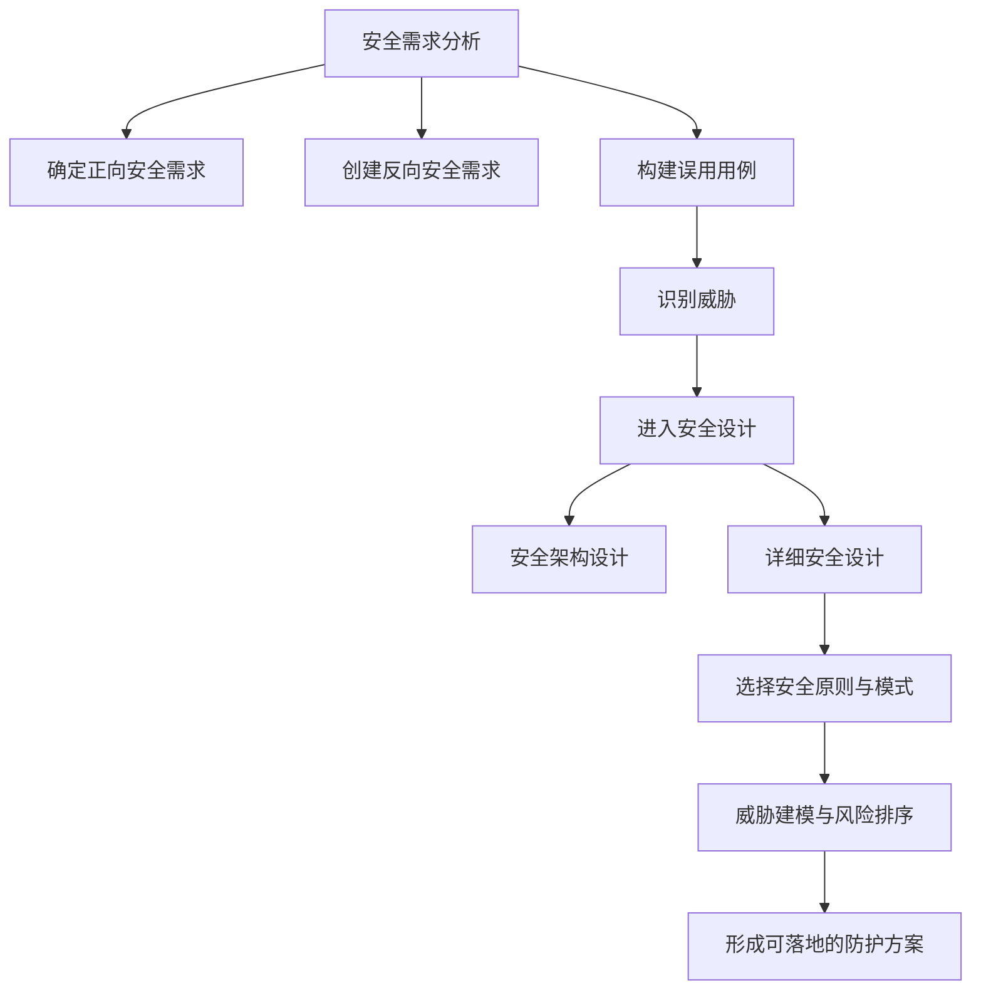

# Intermediate - 软件安全分析与设计

> 本讲义帮助你把“安全需求怎么提、设计怎么落地、威胁怎么找”这三件事串起来，并能用于实际系统分析题。

## 示例导入

假设你要为一个“短视频社交系统”做安全分析。用户会上传视频、登录、评论、互动，管理员还要维护系统配置。

如果只按“正常功能”去想，可能会得到这样的需求：能登录、能上传、能推荐、能互动。  
但从安全角度，还要继续追问：

1. 如果有人用弱密码反复撞库怎么办？
2. 如果有人伪造登录状态，冒充别的用户怎么办？
3. 如果上传内容中夹带恶意脚本，前端页面会不会被注入攻击？
4. 如果管理员配置接口被未授权访问，系统会不会被篡改？

这就是本章的核心：  
**先在需求阶段把安全问题说清楚，再在设计阶段把防护机制放进去，最后通过威胁建模系统地找漏洞和风险。**

---

## 核心知识

### 一、软件安全需求分析：先明确“系统必须安全地做什么”

软件需求分析不仅关注功能，还要同时考虑：

- 功能需求
- 性能需求
- 可靠性和可用性
- 安全性和隐私
- 出错处理
- 接口与约束条件

其中，**安全需求不是附属项**，而是与业务功能需求处于同一层次，并且对业务功能有约束作用。

---

### 1. 安全需求分析的主要任务

#### （1）确定安全要求
目标是形成尽可能完整、准确的安全需求说明，包括：

- 软件应满足哪些安全功能
- 哪些行为是允许的
- 哪些行为是不允许的
- 各项安全工作的责任方和配合方

通常还要建立**正式的书面安全计划**，避免安全责任不清。

#### （2）确定质量门与缺陷等级
“质量门”可以理解为：软件在安全和隐私上，最低能接受到什么程度。

资料中给出的缺陷严重程度包括：

- 致命
- 严重
- 较重
- 一般
- 轻微

缺陷优先级包括：

- 紧急
- 正常
- 不急

这两者不要混淆：

- **严重程度**：这个缺陷有多危险
- **优先级**：这个缺陷该多快处理

#### （3）评估安全和隐私风险
资料中给出的风险等级示例为：

- P1：高隐私风险
- P2：中隐私风险
- P3：低隐私风险

安全需求分析的目标之一，就是识别系统中哪些部分最容易被攻击，哪些风险必须优先处理。

---

### 2. 攻击用例：从攻击者视角补全安全需求

普通需求分析默认用户在理想环境下正常使用系统，但安全分析不能只看“正常人怎么用”，还要看“攻击者怎么滥用”。

#### 正常用例
描述用户在正常场景下的预期行为，例如：

- 用户登录
- 用户下单
- 用户上传视频

#### 误用用例（Misuse Case / Abuse Case，滥用用例）
误用用例是对**负面场景**的建模，用来描述：

- 系统可能受到的威胁
- 恶意用户如何滥用系统
- 某个安全功能缺失或失效时会导致什么后果

它的核心价值是：  
**用攻击者视角发现安全需求。**

---

### 3. 安全需求分析的步骤

资料中给出的安全需求分析步骤可以整理为：

1. **确定正向安全需求**  
   也就是系统应该完成哪些安全功能，哪些行为是可接受的。

2. **创建反向安全需求**  
   也就是当系统不满足安全要求时，会出现什么后果。

3. **考虑所有可能获得系统访问权的用户**  
   不只考虑普通用户，还要考虑管理员、维护人员、外部攻击者等。

4. **构建误用用例**  
   基于反向安全需求，描述恶意用户或攻击者可能如何滥用系统，并借助攻击模式来指导建模。

---

### 二、软件安全设计：把安全需求转化成结构和机制

软件设计阶段的任务是依据需求规格设计软件结构和数据结构。  
很多安全问题不是写代码时才产生的，而是**设计时安全考虑不足**造成的。

因此，安全设计必须在早期完成，因为：

- 设计缺陷越晚发现，修复成本越高
- 设计阶段重视安全，可以减少后期返工
- 可以显著降低软件产品的安全风险

---

### 1. 软件安全设计的两个阶段

#### （1）软件安全架构设计
先根据功能和安全需求构建系统架构，再进行安全性分析和完善。

重点是回答：

- 系统整体怎么分层
- 哪些模块之间需要隔离
- 哪些边界要加强保护

#### （2）软件安全详细设计
对功能模块和数据结构做更细致的设计，并考虑安全性问题。

重点是回答：

- 具体接口如何验证
- 数据如何传输和存储
- 会话如何管理
- 哪些权限应该授予谁

---

### 2. 软件安全设计的主要原则

资料中列出了十条原则，实际设计时常常需要权衡，不一定能同时满足。

#### （1）最小化攻击面原则
攻击面（Attack Surface）是用户、潜在攻击者和其他程序能访问的所有功能与代码的总和。

做法包括：

- 关闭无需开放的端口
- 减少默认可执行代码量
- 限制可访问代码的人员范围
- 限定可访问代码的身份
- 提高执行代码所需权限

可以理解为：  
**能不暴露的入口就不要暴露。**

#### （2）最小授权原则
只授予完成任务所必需的最小权限。

常见做法：

- 只给程序中需要特权的部分授予特权
- 只授予必需权限
- 将特权有效时间尽量缩短

资料举的例子是：  
新版本 Office 在打开不可信来源文档时，默认不可编辑、默认不可执行代码。这样即使存在缓冲区溢出漏洞，攻击者也更难执行恶意代码。

#### （3）权限分离原则
不能把所有权限都给一个用户，让他单独操纵系统，而应把权限分配给多个不同身份协同完成。

常见措施：

- 禁止 root 用户远程登录
- 不同管理员分配不同权限
- 普通管理员不能独占所有权限
- 某些敏感操作需要多个管理员协同执行

这样可以降低“一个账号失陷导致全局失守”的风险。

#### （4）纵深防御原则
不要只依赖单一安全机制，而是使用多重防护。

常见措施包括：

- 边界防御
- 监控

边界防御里，资料提到：

- **防火墙（Firewall）**：在内外网之间建立保护屏障
- **入侵检测系统（IDS）**：不一定阻止攻击，但会监控并识别可疑行为

监控则是：

- 记录日志
- 分析日志
- 尽快识别攻击事件并响应

#### （5）默认安全配置原则
在用户还不熟悉配置之前，系统默认应处于更安全的状态。

常见做法：

- 默认拒绝请求
- 默认关闭不常用功能
- 默认检查口令复杂性
- 达到最大登录次数后默认锁定用户

#### （6）完全控制原则
对任何受保护对象的访问，都应进行授权检查并记录来源。

尤其是缓存的访问操作，也要做细粒度检查，避免攻击者利用缓存绕过身份验证。

#### （7）开放设计原则
安全机制不应依赖“保密设计”来获得安全性。

典型反例是：

- 使用私有加密算法，以为“只有我知道”就更安全

正确思路是：

- 使用标准、公开、可验证的算法
- 数据安全依赖密钥等受保护元素，而不是依赖算法秘密

#### （8）保护最弱环节原则
攻击者通常会优先攻击最弱的一环，而不是最强的一环。

因此设计时应：

- 全面做风险分析
- 找出最容易被利用的风险
- 按严重程度排序
- 优先处理最危险的薄弱点

#### （9）安全机制的经济性原则
系统越复杂，往往安全风险越高。

因此应尽可能让安全机制简洁：

- 更容易维护
- 更容易检测漏洞
- 修复成本更低

#### （10）安全机制心理可接受原则
安全机制不能明显降低用户可用性，否则用户容易关闭或绕过。

好的安全机制应：

- 符合用户习惯
- 不给合法用户额外负担
- 尽量不影响正常访问

---

### 3. 软件安全设计的方法与模式

资料以 Web 应用为例，给出一些常见方法：

#### （1）服务器端验证
设计人员应认为用户输入都不可信。

原则是：

- 客户端收集的数据必须先验证
- 验证通过后，服务器才处理

#### （2）分页传输数据
当客户端要传大量数据时，不要一次性全部传输。

原因是：

- 占用资源多
- 性能差

做法是分页处理，只传服务器当前需要的数据页。

#### （3）使用安全协议传输
资料提到的协议包括：

- SSL
- HTTPS
- SET

目的都是加强传输过程中的安全性。

#### （4）会话管理
会话（Session）中存储的对象，在使用后应立即删除并释放。

否则可能被冒用身份发起攻击。

---

### 4. 五种常见的软件安全设计模式

资料列出了五种模式及其关注点：

1. **认证器模式**  
   目的：验证访问者是否真的是其声称身份  
   关注点：用户或系统鉴别

2. **基于角色的访问控制模式**  
   目的：按人的任务分配功能与权限  
   关注点：访问控制

3. **安全的 MVC 模式**  
   目的：提高基于 MVC 系统的用户交互安全性  
   关注点：系统交互

4. **传输层安全 VPN 模式**  
   目的：通过隧道和加密建立安全通道，并进行端点鉴别与访问控制  
   关注点：安全通信

5. **安全日志与审计模式**  
   目的：记录并分析用户行为  
   关注点：审计

---

### 5. 基于安全模式的设计流程

资料给出的流程分为三个阶段：

#### （1）风险评估
包括：

- 风险识别
- 风险评估
- 风险描述

#### （2）安全模式选取
包括：

- 选择安全模式
- 评估安全模式
- 系统框架重构

这里会把新功能加入原有高层设计，形成最终安全架构。

#### （3）安全模式细化
将选定的安全模式具体化：

- 在实例化框架中添加安全模式
- 根据安全模式后的系统框架和业务需求，重构业务类图
- 生成详细系统设计类图

---

### 6. 威胁建模：系统化识别潜在攻击

威胁建模是识别、分类和分析软件中潜在威胁的形式化方法。  
它可以贯穿整个软件安全开发生命周期。

作用包括：

- 减少安全相关设计缺陷
- 减少编码缺陷
- 降低残留安全缺陷的严重程度
- 减小软件安全风险

---

### 7. 威胁建模的分类

#### 按关注对象分类

1. **关注资产**
   - 资产是有价值的东西
   - 理论上合理，但实际建模效果并不总是最好

2. **关注攻击者**
   - 通过识别潜在攻击者的身份和特征来推测威胁

3. **关注软件本身**
   - 实际中最常用
   - 建模效果更直接

#### 按应用阶段分类

1. **主动式建模（防御式建模）**
   - 常用于开发早期
   - 适合规格和设计阶段
   - 缺点是早期难以预测所有威胁

2. **被动式建模（对抗式建模）**
   - 常用于产品创建和部署之后
   - 有助于发现已存在缺陷
   - 需要后续更新或打补丁

实际开发中通常是：

- 设计阶段尽可能用主动式建模
- 后期对未预测到的威胁再用被动式建模补充

---

### 8. 两种主流威胁建模方法：STRIDE 与攻击树

#### （1）STRIDE
STRIDE 是微软提出的威胁建模方法，包含六类威胁：

- **S：Spoofing（假冒）**
- **T：Tampering（篡改）**
- **R：Repudiation（抵赖）**
- **I：Information Disclosure（信息泄露）**
- **D：Denial of Service（拒绝服务）**
- **E：Elevation of Privilege（权限提升）**

其升级版本是 **ASTRIDE**，增加了 **Privacy（隐私）**。

#### （2）DREAD
DREAD 常作为 STRIDE 的补充，用来评估威胁等级，五个维度是：

- 破坏力
- 可重复攻击性
- 漏洞利用难度
- 影响用户数
- 漏洞隐蔽程度

它帮助我们判断：  
**哪个威胁更值得优先处理。**

#### （3）攻击树
攻击树是一种用树结构描述攻击逻辑的方法。

- 根节点：攻击者最终目标
- 中间节点：实现目标的中间步骤
- 叶节点：具体攻击事件
- AND 节点：多个条件都要满足
- OR 节点：满足其中一个即可

它的价值是帮助分析：

- 哪些攻击路径更可能发生
- 如何更有效地阻止攻击

---

### 9. 实例分析：短视频社交系统

资料给出的短视频社交系统实例，体现了安全需求分析的实际做法。

#### 用户类型
- 经常性用户：短视频观众、视频创作者、管理员
- 间隔性用户：系统维护人员

#### 系统目标
- 保证视频内容满足娱乐需求并符合监管要求
- 提供良好的人机交互
- 提供稳定流畅的视频服务
- 提供社区互动
- 跟踪偏好并进行精准推荐

#### 安全需求分类
1. **核心安全需求**
   - 保密性
   - 完整性
   - 可用性
   - 可认证
   - 授权
   - 监控与审计

2. **通用安全需求**
   - 安全架构
   - 会话管理
   - 控制重复提交
   - 配置参数管理

3. **运维安全需求**
   - 环境部署
   - 归档
   - 登录控制

---

### 10. 实例分析：Web 火车订票系统威胁建模

这个实例非常适合练习“从系统功能到威胁”的分析思路。

#### 第一步：明确安全目标
包括：

- 登录安全
- 数据安全
- 支付安全
- 审计安全
- 响应安全

#### 第二步：系统概要分析
系统主要流程包括：

- 用户登录
- 前端初步验证后，把账号密码发给后台数据库比对
- 查询车次并订票
- 有余票且支付成功后创建订单并减少余票
- 管理员可维护车次和站点信息

#### 第三步：系统功能分解
资料分解了三个模块：

- 登录验证模块
- 订票模块
- 管理员维护模块

#### 第四步：确定威胁
资料给出了常见威胁与缓解措施对应关系，例如：

- 输入验证不足：缓冲区溢出、SQL 注入、XSS
- 认证问题：网络窃听、暴力攻击、字典攻击、Cookie 重播、凭证窃取
- 授权问题：泄露机密数据、篡改数据
- 配置管理问题：未授权访问管理界面和配置文件
- 会话管理问题：会话劫持、会话重播、中间人攻击
- 加密问题：破解算法、破解密钥
- 参数操纵：查询字符串、表单、Cookie、HTTP 头操纵
- 异常管理：拒绝服务、泄露系统信息
- 审计和日志：抵赖操作、掩盖踪迹

#### 第五步：制定缓解策略
资料按风险高低列出了一些重点威胁：

1. 基于字典的暴力破解
2. SQL 注入
3. 凭证偷窃
4. 网络窃听
5. 拒绝服务
6. Cookie 重播或捕获
7. XSS 注入
8. 抵赖操作、逃避审计

这说明在实际设计中，应优先处理高风险威胁。

---

---

## 关键术语

- **安全需求**：软件在安全和隐私方面必须满足的要求，与业务需求同层次。
- **误用用例**：从负面或恶意场景描述系统如何被滥用，用于发现安全需求。
- **攻击面**：外部用户、攻击者和其他程序可接触到的软件功能与代码总和。
- **最小授权原则**：只给完成任务所必需的最小权限。
- **权限分离原则**：把权限分配给多个角色协同完成，避免单点全权。
- **纵深防御**：使用多层安全机制，而不是只靠一种防护。
- **默认安全配置**：系统默认就尽量安全，减少用户误配风险。
- **完全控制原则**：任何访问都要授权检查，并能追踪来源。
- **开放设计原则**：安全不依赖设计秘密，依赖标准算法和密钥保护。
- **STRIDE**：六类常见威胁模型，分别是假冒、篡改、抵赖、信息泄露、拒绝服务、权限提升。
- **DREAD**：用于评估威胁严重程度的五个维度模型。
- **攻击树**：用树状结构描述攻击目标与攻击路径的方法。

---

## 常见误区

- 把“功能需求”和“安全需求”分开看。实际上，安全需求是需求的一部分，不能后补。
- 只写“要安全”这种空话，不写具体行为、边界和约束。
- 误以为“加密了就安全”，忽略认证、授权、会话、日志和输入验证。
- 把“缺陷严重程度”和“处理优先级”混为一谈。
- 认为只要在开发后加补丁就行，忽视设计阶段的安全成本更低。
- 只靠单一安全措施防护，不做纵深防御。
- 只看正常用户流程，不分析攻击者如何滥用系统。
- 把攻击树、STRIDE、DREAD混为一体；它们是不同层面的工具：建模、分类、评估各有用途。

---

## 自测问题

- 为什么软件安全需求必须与业务功能需求处于同一层次？
- 误用用例和正常用例有什么区别？
- 请用自己的话解释“最小化攻击面”“最小授权”“权限分离”。
- 为什么开放设计原则反对依赖私有加密算法的“保密安全”？
- STRIDE 的六种威胁分别是什么？
- DREAD 的五个评估维度分别是什么？
- 攻击树中根节点、叶节点、AND、OR 分别表示什么？
- 在火车订票系统中，为什么 SQL 注入、暴力破解和会话劫持通常要优先处理？
- 短视频社交系统的核心安全需求、通用安全需求、运维安全需求分别有哪些？
